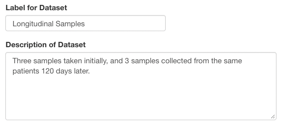
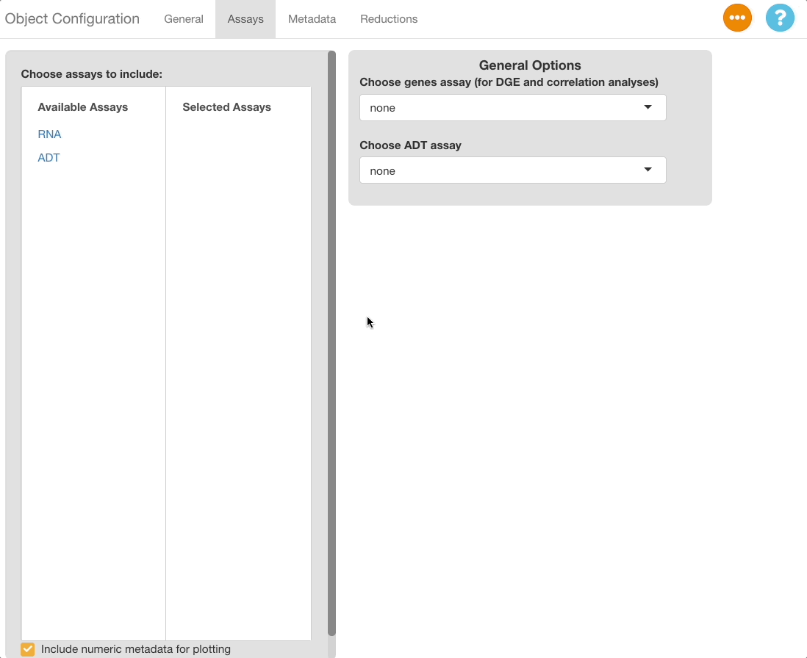
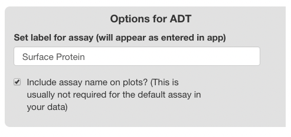
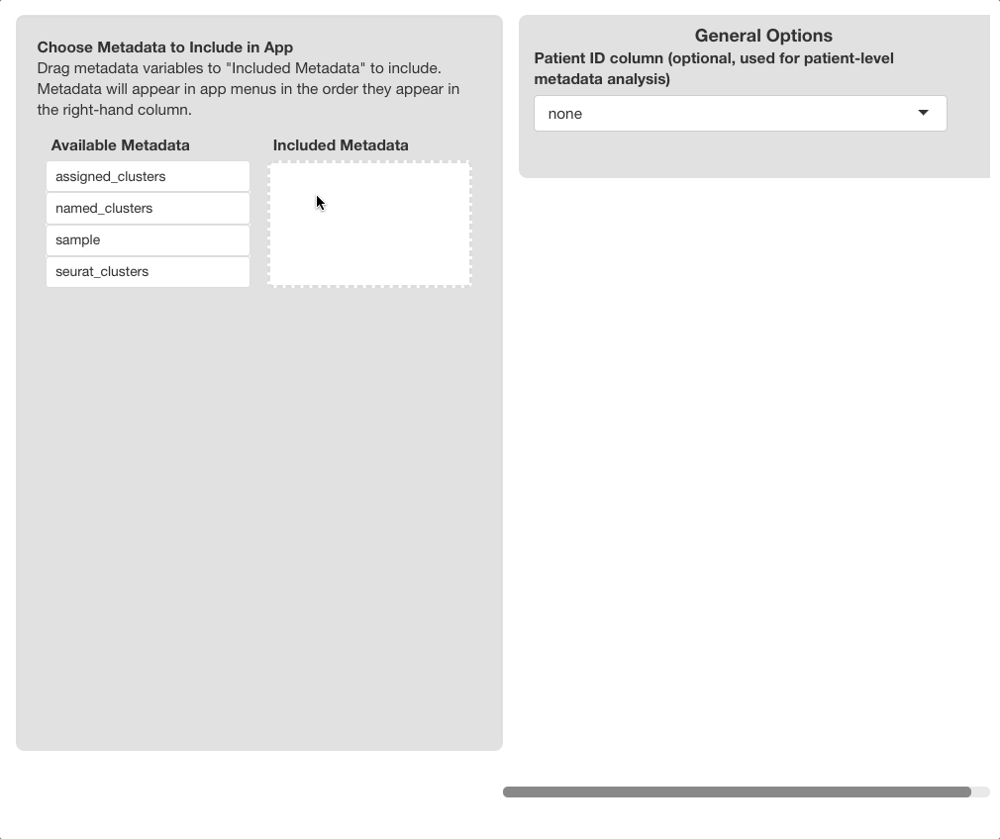
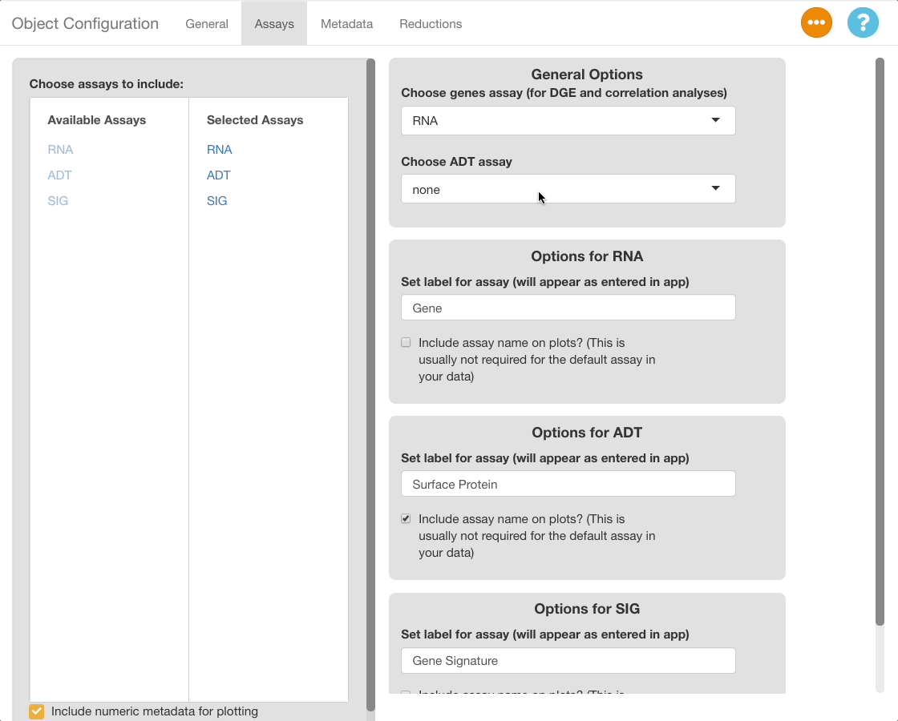
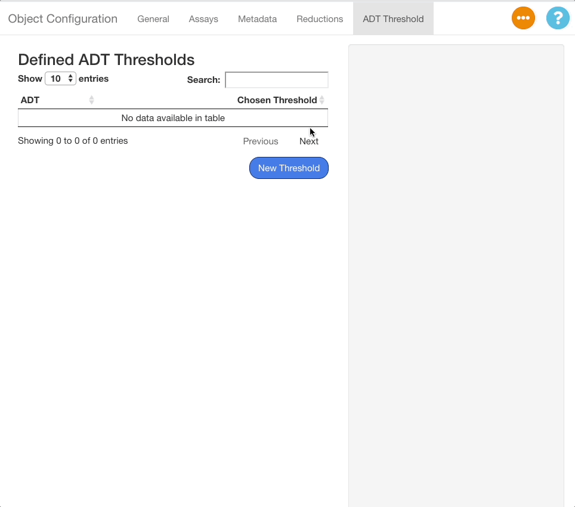
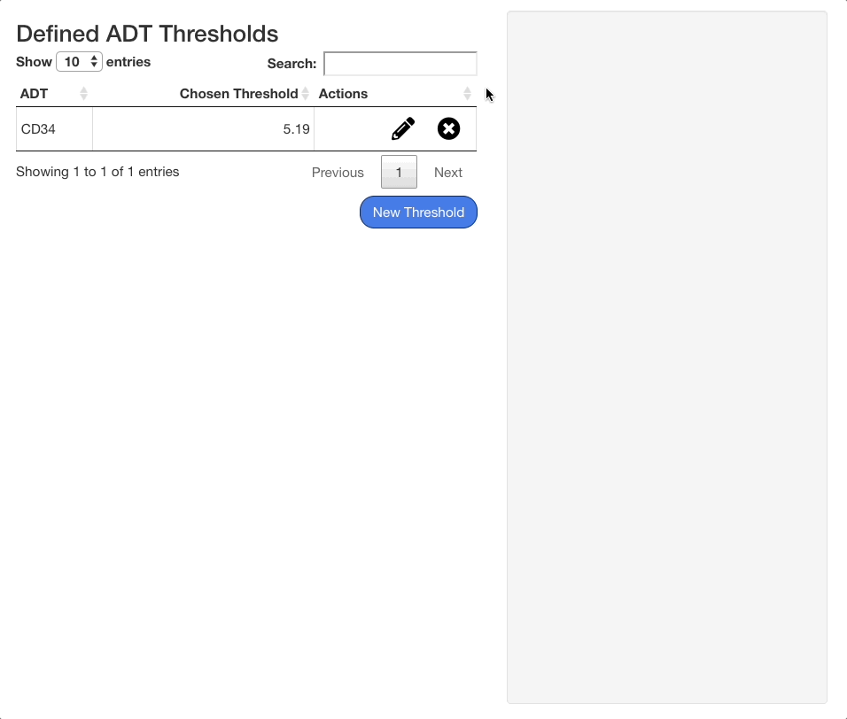

# scExploreR Config App Documentation

The scExploreR config app is used to configure single-cell objects for
display in the main browser. This vignette will walk through the
operation of the app and detail all settings that may be adjusted.

For guidelines on preparing objects before loading them into the config
app, see the [object guidelines
vignette](https://amc-heme.github.io/scExploreR/articles/object_guidelines.md),
and see the [app setup walkthrough
vignette](https://amc-heme.github.io/scExploreR/articles/dataset_setup_walkthrough.md)
for an interactive walkthrough of both object preparation and use of the
config app.

## Running the config app

The config app can be ran from R Studio or the console by entering the
following command:

    run_config(
      object_path = "./object.rds", 
      config_path = NULL 
      )

The `object_path` argument is required. It must be an set to one of the
following:

- For Seurat objects, the path to the .rds file.
- For SingleCellExperiment objects, the path to the .rds file. If the
  object has been saved via
  [`HDF5Array::saveHDF5SummarizedExperiment()`](https://rdrr.io/pkg/HDF5Array/man/saveHDF5SummarizedExperiment.html),
  this should be the path to the **directory** created.
- For anndata objects, the path to the .h5ad file.

The `config_path` argument is optional and is used to load an existing
config file into the app for further editing (for more on this, see
[loading a config file](#load-config-file) below).

##### Warning

If you are loading a SingleCellExperiment saved using the `HDF5Array`
package, you must additionally provide the parameter
`is_HDF5SummarizedExperiment = TRUE`. The config app will not load
successfully unless you do this.

##### Note

Make sure that the config file loaded is based on the same object as the
one specified. We recommend naming your config files using the
convention “{object_name}\_config.yaml” to avoid confusion.

## General Info Tab

Upon loading the config app, the “General” tab will be displayed. This
tab is used to enter information on the dataset that will be displayed
in the main app when the user opens the “Choose Dataset” window.

Use **“Label for Dataset”** to enter a short label for the dataset. Add
detailed info for the dataset using the **“Description of Dataset”**
field.

Use the **“Content for Dataset Preview”** menu to optionally add a plot
as a preview image in the “Choose Dataset” window of the main app. When
selecting “DimPlot” as a preview option, a window will appear below with
settings for the plot, and a window showing the plot as it will appear
in the main app.

##### Plot Settings

Use the **“Metadata to Group By”** to choose the variable for coloring
the cells. If the “Label Groups” checkbox is enabled, each color group
will also be labeled with the value it represents.The **“Metadata to
Split By”** menu may optionally be used to select a variable to “split”
the plot, and the number of columns in a split plot can be controlled
with the **“Number of columns”** slider. The projection used for the
plot is set with **“Choose Reduction”**.

## Assays Tab

Settings for the assays to be included in the Seurat object are entered
in the assays tab.

##### Adding/Removing Assays

To choose which assays to expose in the browser, use the **“Choose
assays to include”** menu in the left half of the window. All assays
added to the object will appear on the left hand side of the two-column
menu, under **“Available Assays”**. Select an assay from this tab to add
it to the browser. The assay will now appear under the **“Selected
Assays”** column, and a panel of options specific to the assay will
appear on the right half of the app window. To remove an assay from the
browser, click the assay name in the **“Selected Assays”** tab.

#### General Options

On the upper right-hand corner of the screen, a panel of general
assay-related options is displayed. The available options are explained
below.

##### *“*Choose Genes Assay”

The assay selected in this menu will be the assay used when computing
differential expression. It does not effect plotting.

Note, if you wish to include only non-gene assays in the object, you may
designate those assays as the “genes” assay, but this may cause issues
with the DGE and correlation analyses. The analyses are validated for
gene expression only, and may not be accurate when using other data
types. We will address means of including these data types in analyses
in the future.

##### “Choose ADT Assay”

If you have a surface protein (ADT) assay in your object, you can
specify the assay here to define ADT thresholds. ADT thresholds
transform expression data for plots to filter out cells that are
unlikely to express the ADT in reality, improving the clarity of feature
plots. For more information, see the “ADT Threshold Tab” section.

#### Options for Each Assay

Each assay-specific panel will have a text box for entering a label, and
a checkbox for including the name of the assay on plots. The label
appears in the feature selection menus, and it may be set to a
descriptive name to improve the presentation of the main browser
(i.e. displaying the genes assay as “Genes”, or the ADT assay as
“Surface Protein”, rather than using the Seurat defaults “RNA” and
“ADT”). If the checkbox is selected, the label entered will display on
plots. For example, if the label is “Gene”, feature plots for the gene
“TP53” will have a default title of “TP53 (Gene)” instead of just
“TP53”.

## Metadata Tab

The metadata tab is used to specify which metadata variables to include,
and to set settings for each metadata variable.

##### Adding/Removing/Sorting Metadata

Use the **“Choose Metadata to Include”** menu on the left side of the
screen to choose metadata variables to include in the browser.
Initially, all variables in `object@meta.data` will display under the
**“Available Metadata”** column. To include a metadata variable, click
and drag the variable to the **“Included Metadata”** section.

**Which metadata should I include?** We recommend including variables
that are directly related to the experimental design and are easily
understood by your target audience. Variables describing properties such
as cell type, sample, or patient, or those related to experimental
design such as control vs. treated cells, or timepoint, should be
included in the browser. It is not recommended to include variables such
as the capture chemistry used in scRNA-seq, or cell type annotations
that are not biologically relevant (such as numbered clusters applied by
Seurat, unless you have not identified these clusters or you have
determined they are relevant to your target audience).

The order the variables appear in this column is recognized by the
browser; metadata in the plotting and subset menus will appear in the
order set here. **The first variable will be the default variable used
for coloring plots**; we highly recommend setting this to “clusters”,
“cell type”, or a similar variable. To remove a variable, drag it back
to the **“Available Metadata”** column.

#### General Options

##### “Patient/Sample Variable”

The variable chosen in this selection menu will be the one used for the
“Metadata Pie Chart” plot in the main app. If your dataset consists of
multiple samples (or patients), choose the metadata variable that
corresponds to sample or patient to allow users to view composition of
the dataset at the sample level (for example, seeing how many patients
are in one treatment category or time point versus another, as opposed
to how many cells).

#### Options for Each Metadata Variable

A panel of options will appear on the right side of the screen for each
metadata variable included. The header of each panel will display the
name of the variable as it appears in the object, whether the variable
is categorical or numeric, and how many unique values of the variable
exist. Beneath the header, unique values are displayed to assist in the
identification and naming of variables.

Currently, only categorical metadata is available for inclusion in the
object, since numeric metadata does not yet work with the subset menus.
Support for numeric metadata will be added in a future release.

Use the **“Set label for metadata variable”** text box to set a display
name in the app. The name entered here will display in all plotting
menus that use categorical metadata, as well as in subset menus in all
three tabs.

The **“Group metadata into categories?”** switch is used to create
display groups using the values in the metadata variable. The groups
chosen here are displayed in the main app as a guide for choosing
subsets in either of the tabs of the main app. This is useful in cases
where the dataset contains samples from different experimental groups.
Grouping samples in the config app aids the end user in understanding
which samples fall in which treatment group. Groups may also be used for
clustering detailed cell annotations into more general annotations for
facilitated interpretation by the end user.

##### Using the Metadata Groups Interface

Enable the **“Group metadata into categories?”** switch to display the
interface. Two fields will display initially for the first group.

The first field is used to choose a name for the group, and the second
field is used to choose group members from the classes of the variable.
Available classes will appear as you type.

To add additional groups, press the “Add Group” button. For each group
added, fields for the group name and members will appear.

To delete a group, click the “X” button to the right of each field. The
first field can’t be deleted; to omit this field, disable the **“Group
metadata into categories?”** switch.

## Reductions Tab

The reductions tab is used to set the dimensional reductions
(projections) to include in the object, and in which order to display
them. The selections here affect all DimPlots and Feature Plots in the
app.

Click and drag reductions from the **“Available Reductions”** to the
**“Included Reductions”** section to include them in the app. The order
the reductions appear will be the order they will display in the in-app
menus, and the first reduction in the config app will be the default
projection displayed in the app. Click and drag the reductions to change
their order.

For each reduction, the **label** may be set. The reduction will appear
in the app as it is labeled here.

## ADT Threshold Tab

For Seurat Objects with ADT assays, the ADT Threshold Tab allows the
user to choose thresholds below which the biological expression of ADTs
is likely zero, even if the expression values themselves is greater than
zero. The use of this tab will help remove statistical noise from the
measurements, giving the end user a more accurate picture of where
surface proteins are being expressed in a sample.

#### Enabling the ADT Threshold Tab

The ADT Threshold Tab is hidden by default. To show the tab, make a
selection under “Choose ADT Assay” in the assays tab.

#### Adding ADT Thresholds

To add an ADT threshold, click the **“New Threshold”** button in the ADT
threshold tab, and then use search menu that appears to the right of the
table to search for an ADT.

When an ADT is selected in the search menu, a ridge plot showing the
distribution of expression values in each cell will appear below the
menu. Click the plot to set a threshold for the ADT. To aid in placement
of the threshold, a grey vertical line will appear when mousing over the
plot, and a darker line will appear at the last value selected.

When a selection is made, a panel of statistics will display below the
plot. The panel will show the value of the chosen threshold, and the
number and percentage of cells above and below the threshold.

To save a threshold, click the **“Confirm”** button beneath the stats
panel. To exit without saving the threshold, click **“Cancel”**. When a
threshold is saved, it will appear on the table of saved thresholds on
the left hand side of the screen.

#### Editing and Deleting ADT Thresholds

To edit an existing threshold, click the icon next to the desired ADT in
the table. The same interface shown when adding an ADT value will appear
on the right hand side of the screen, with the previous value selected.
Press **“Confirm”** to save any changes made.

To delete a threshold, press the button next to the desired ADT.

## Saving and Loading Config Files

#### Saving

To save a config file, press the button in the upper right corner and
select “Save Config File”. A window will appear to save the config file
to your local file system. The file will save in a .yaml format.

#### Loading

To load a config file, call
[`run_config()`](https://amc-heme.github.io/scExploreR/reference/run_config.md)
with the path to the saved file:

    run_config(
      object_path = "./object.rds", 
      config_path = "./config_file.yaml" 
      )

When the app loads, press the button in the upper right corner and
select “Load Config File”. All fields in the app will update based on
the information read from the file. Each time this button is pressed,
the information entered will be reset to what is in the file, so be
careful to avoid overwriting data. If the app is launched with
`config_path` equal to `NULL`, the app will not fill any fields.
