```{scss document_css, echo = FALSE}
/* Centers text and block elements */
.center{
  text-align: center;
  /* Display must be set to block for centering to work */
  display: block;
  }

.white-text{
  color: white;
}

/* CSS for callouts
   From https://codepen.io/superjaberwocky/pen/rLKxOa */
   /* Requires SASS to be enabled, with sass package and "scss" code chunk*/
.callout {
  padding: 20px;
  margin: 20px 0;
  border: 1px solid #eee;
  /* If the border-radius is greater than border-left-width,  
     the left border will curve inward onto the element's body,
     creating a cresent-like shape*/
  border-left-width: 8px;
  border-radius: 8px;
  h4 {
    margin-top: 0;
    margin-bottom: 5px;
  }
  p:last-child {
    margin-bottom: 0;
  }
  code {
    border-radius: 3px;
  }
  & + .bs-callout {
    margin-top: -5px;
  }
}

/* Define properties for default, primary, info, etc. classes*/
@each $name,$color in 
  (default,#777),
  (primary,#428bca),
  (success,#5cb85c),
  (danger,#d9534f),
  (warning,#f0ad4e),
  (info,#5bc0de), 
  (bdc,#29527a){
  .callout-#{$name} {
    border-left-color: $color;
    /* Background: color above, with an alpha hex value of '35'*/
    background-color: #{$color + '35'};
    h4 {
      color: $color;
    }
  }
}

/* Adds a mrgin-top of 0 to the existing bootstrap class to remove white space
   that appears when using the card component in an Rmd */
.card-header{
  margin-top: 0px;
}

/* Applied to output of code chunks. Causes a scrollbar to appear 
   when the output extends beyond the max-height. */
/* Adapted from https://bookdown.org/yihui/rmarkdown-cookbook/html-scroll.html */
/* Classes are defined for several max heights */
@each $height in 
  80,
  100,
  300{
  .scroll-#{$height} {
    max-height: #{$height + "px"};
    overflow-y: auto;
    background-color: inherit;
  }
}

/*
.scroll-80 {
  max-height: 80px;
  overflow-y: auto;
  background-color: inherit;
}

.scroll-100 {
  max-height: 100px;
  overflow-y: auto;
  background-color: inherit;
}

.scroll-300 {
  max-height: 300px;
  overflow-y: auto;
  background-color: inherit;
}*/
```

<!-- Load datasets for use in the vignette -->

This vignette will walk you through the process of setting up a dataset in scExploreR. This vignette is based on the Small Cell Lung Carcinoma dataset analyzed by [Chan et al. 2021](https://www.cell.com/cancer-cell/fulltext/S1535-6108(21)00497-9#gr1). To download the datasets for this tutorial, [go here](https://cellxgene.cziscience.com/collections/62e8f058-9c37-48bc-9200-e767f318a8ec) and download the following datasets:

```{=html}
<!-- Why is the user downloading these datasets? To replicate the paper. Add a note for this 

Only the combined samples dataset and the SCLC epithelial cells dataset will be covered in the vignette.
-->
```
-   Combined samples 
<!-- -   Epithelial cells -->
-   SCLC epithelial cells

Chan et al. use all three datasets in their analysis, and the same will be done in this example. The "Epithelial cells" dataset is a subset of the "Combined samples" dataset that has been re-clustered. Likewise, the SCLC epithelial cells dataset is a subset of the epithelial cells dataset. See **Figure 1A** of Chan et al. for a visual representation.

You may choose either the Anndata or the Seurat formats for download, though we recommend the Anndata format due to improved performance and decreased RAM requirements. This article will cover operations on the Anndata object.

::: {.callout .callout-info}
#### Note

While the anndata format is exclusive to python, anndata objects can be explored in R Studio with R-style commands using the [Reticulate](https://rstudio.github.io/reticulate/) package. The example in this vignette uses Reticulate, along with the [anndata](https://anndata.dynverse.org) R package, and SCUBA, which provides utility functions for common exploration/data accession operations in single cell objects.
:::

<!-- Vignette Overview/Goals Statement -->
<!-- Update this after finishing the vignette -->

By the end of this example, you will be able to set up an scExploreR instance with both datasets<!--, and you will be able to reproduce some of the figures in the paper using the plots tab. This vignette will also show how to identify differentially expressed genes between groups of cells using a wilcoxon rank sum-->.

::: {.card .mb-3}
::: {.card-header style="background-color: #555588;"}
#### Process to host a dataset in scExploreR {.card-title .center .white-text}
:::

::: {.card-body style="background-color: #E1E1E1;"}
1.  Explore object to determine appropriate data to display in app.
2.  Use the config app to select relevant data and generate a config file
3.  Launch scExploreR using the created config file
:::
:::

# Dataset Exploration

To host a dataset in scExploreR, you must indicate which metadata variables, reductions, and modalities to include in the app. Whether you are setting up the app for end users or yourself, careful selection of the most relevant data is key to maximizing the effectiveness of scExploreR for your dataset.

To understand what aspects to include, it is best to explore the object to identify relevant modalities, metadata, and reductions. When hosting objects you have preprocesssed, you will likely be familiar enough with the object to skip this step.

In this section, we will load the "Combined Samples" and "SCLC epithelial cells" objects and explore relevant data to include in the scExploreR instance.

::: {.callout .callout-info}
#### Note

The example below is one of many ways this step can be approached. With other objects, the process of understanding relevant data may also involve communicating with staff involved in sequencing of your samples and preprocessing of the data.
:::

::: {.callout .callout-info}
#### Note

For objects that you preprocess, it is good practice to include details on the metadata in your object. This is helpful for when you share your object upon publication, or for sharing your object internally or with collaborators. There are many ways to do this, though anndata formats make this easy using the unstructured (`uns`) data slot. One suggestion is to add a python dictionary to `uns` with relevant variable names as keys, and information on each variable as values.
:::

Run the code below to load the Combined Samples dataset, replacing the path with the path to the downloaded object.


```r
library(anndata)

full_dataset <- 
  anndata::read_h5ad(
    # Replace the path below with the path to the downloaded dataset
    "~/datasets/small_cell_lung_cancer/SCLC_Full.h5ad"
    )
```

## Metadata

Metadata variables are chosen when setting up an object to populate dropdowns with options for grouping (coloring) cells on plots, or for splitting plots. Chosen metadata also populates the choices avaliable in subsetting, determining how the user can select sub-populations for further exploration.

scExploreR allows you to select as many metadata variables as you like, even all of the ones in the object, but the app functions best when included metadata is limited to a handful of relevant variables. Adding variables less relevant to the end user provides limited benefit, and may even overwhelm users.

The object in this example contains 35 metadata variables. Let's explore the variables to narrow down which are the most relevant.


```r
SCUBA::meta_varnames(full_dataset)
```

```{.scroll-100}
##  [1] "ngenes"                                  
##  [2] "libsize"                                 
##  [3] "mito_frac"                               
##  [4] "RBP_frac"                                
##  [5] "batch"                                   
##  [6] "donor_id"                                
##  [7] "treatment"                               
##  [8] "procedure"                               
##  [9] "histo"                                   
## [10] "cell_type_coarse"                        
## [11] "cell_type_fine"                          
## [12] "cell_type_general"                       
## [13] "clusters"                                
## [14] "cell_type_med"                           
## [15] "H_knn"                                   
## [16] "development_stage_ontology_term_id"      
## [17] "sex_ontology_term_id"                    
## [18] "self_reported_ethnicity_ontology_term_id"
## [19] "assay_ontology_term_id"                  
## [20] "is_primary_data"                         
## [21] "tissue_ontology_term_id"                 
## [22] "disease_ontology_term_id"                
## [23] "organism_ontology_term_id"               
## [24] "cell_type_ontology_term_id"              
## [25] "suspension_type"                         
## [26] "HTAN_Biospecimen_ID"                     
## [27] "HTAN_Participant_ID"                     
## [28] "cell_type"                               
## [29] "assay"                                   
## [30] "disease"                                 
## [31] "organism"                                
## [32] "sex"                                     
## [33] "tissue"                                  
## [34] "self_reported_ethnicity"                 
## [35] "development_stage"
```

Only categorical metadata variables may be selected for use in the app. Below we identify categorical metadata variables.


```r
full_unique_vars <- SCUBA::meta_varnames(full_dataset)

# Iterate through metadata variables and return a vector specifying whether 
# the variable is categorical (character, factor), or numeric (numeric, 
# double, integer)
var_classes <- 
  sapply(
    full_unique_vars,
    # Compute the class of the variable
    function(meta_var){
      class(sclc_dataset$obs[[meta_var]])
    }
  )

# Sort to group classes together
sort(var_classes)
```

```{.scroll-300}
##                                    batch 
##                                 "factor" 
##                                 donor_id 
##                                 "factor" 
##                                treatment 
##                                 "factor" 
##                                procedure 
##                                 "factor" 
##                                    histo 
##                                 "factor" 
##                                 clusters 
##                                 "factor" 
##       development_stage_ontology_term_id 
##                                 "factor" 
##                     sex_ontology_term_id 
##                                 "factor" 
## self_reported_ethnicity_ontology_term_id 
##                                 "factor" 
##                   assay_ontology_term_id 
##                                 "factor" 
##                  tissue_ontology_term_id 
##                                 "factor" 
##                 disease_ontology_term_id 
##                                 "factor" 
##                organism_ontology_term_id 
##                                 "factor" 
##               cell_type_ontology_term_id 
##                                 "factor" 
##                          suspension_type 
##                                 "factor" 
##                      HTAN_Biospecimen_ID 
##                                 "factor" 
##                      HTAN_Participant_ID 
##                                 "factor" 
##                                cell_type 
##                                 "factor" 
##                                    assay 
##                                 "factor" 
##                                  disease 
##                                 "factor" 
##                                 organism 
##                                 "factor" 
##                                      sex 
##                                 "factor" 
##                                   tissue 
##                                 "factor" 
##                  self_reported_ethnicity 
##                                 "factor" 
##                        development_stage 
##                                 "factor" 
##                          is_primary_data 
##                                "logical" 
##                                   ngenes 
##                                   "NULL" 
##                                  libsize 
##                                   "NULL" 
##                         cell_type_coarse 
##                                   "NULL" 
##                           cell_type_fine 
##                                   "NULL" 
##                        cell_type_general 
##                                   "NULL" 
##                            cell_type_med 
##                                   "NULL" 
##                                    H_knn 
##                                   "NULL" 
##                                mito_frac 
##                                "numeric" 
##                                 RBP_frac 
##                                "numeric"
```

This example will identify relevant metadata following the guiding questions below. The questions apply to other objects as well.

::: {.card .mb-3}
::: {.card-header style="background-color: #555588;"}
#### Guiding Questions for Metadata Selection {.card-title .center .white-text}
:::

::: {.card-body style="background-color: #E1E1E1;"}
-   Which variables represent cell type annotation, or clustering?
-   If there are multiple variables for cell type, which are most relevant to the end user?
-   Do the different variables reflect resolutions for cell type, and if so, which resolution is most appropriate?
-   Is there a variable for patient (or sample)?
-   Are there clinically relevant variables, or variables reflecting research goals of the study?
-   Are there any other variables that delineate subsets of cells users may find interesting?
:::
:::

::: {.callout .callout-info}
#### Note

While Numeric metadata can't be used for subsetting or choices on plots, it may be plotted like features, if allowed via the config app. See the config app section for instructions on how to enable/disable this usage.
:::

In the Chan et al. dataset, there are six metadata variables related to cell type: cell_type_coarse, cell_type, cell_type_fine, cell_type_general, clusters, and cell_type_med.

To identify which are relevant, one approach is to look at the unique values for each variable. You can get this information in a single function call using the `unique_values()` function from the [SCUBA](https://github.com/amc-heme/SCUBA#readme) package.


```r
SCUBA::unique_values(
  object = full_dataset,
  var = "cell_type_fine"
  )
```

```
##  [1] T cell         SCLC-N         Endothelial    SCLC-A         SCLC-P        
##  [6] AE1            Basal          Macrophage     DC             NSCLC         
## [11] Ciliated       Neuroendocrine Plasma cell    Ionocyte       Hepatocyte    
## [16] Mast           B cell         Fibroblast     AEP            Neutrophil    
## [21] Mucinous       Erythrocyte    Club           Tuft          
## 24 Levels: AE1 AEP B cell Basal Ciliated Club DC Endothelial ... Tuft
```

It may also be helpful to look at the number of unique values in the object for each variable.


```r
cell_type_vars <- 
  c("cell_type_coarse", 
    "cell_type_fine", 
    "cell_type_general", 
    "cell_type",
    "clusters", 
    "cell_type_med"
    )

for (meta_var in cell_type_vars){
  print(meta_var)
  
  # Pass results of unique_values to length() to get the number of values
  n_unique <-
    SCUBA::unique_values(
    object = full_dataset,
    var = meta_var
    ) |> 
    length()
  
  print(n_unique)
}
```

```
## [1] "cell_type_coarse"
## [1] 4
## [1] "cell_type_fine"
## [1] 24
## [1] "cell_type_general"
## [1] 3
## [1] "cell_type"
## [1] 11
## [1] "clusters"
## [1] 56
## [1] "cell_type_med"
## [1] 16
```

We see that `cell_type_general` and `cell_type_coarse` have the lowest resolution, and that there are very many clusters in `clusters`. `cell_type_fine` and `cell_type_med` have a middling resolution.

Which resolution is most appropriate? Let's plot the each one find out. <!-- Let's plot each metadata variable to see which resolution is most appropriate. -->


```r
library(patchwork)

cell_type_vars <- 
  c("cell_type_general", 
    "cell_type_coarse",
    "cell_type",
    "cell_type_med", 
    "cell_type_fine", 
    "clusters"
    )

plots <- list()

for (meta_var in cell_type_vars){
  plots[[meta_var]] <- 
    SCUBA::plot_reduction(
      full_dataset,
      group_by = meta_var,
      label = TRUE
      ) 
}

wrap_plots(plots, ncol = 2)
```

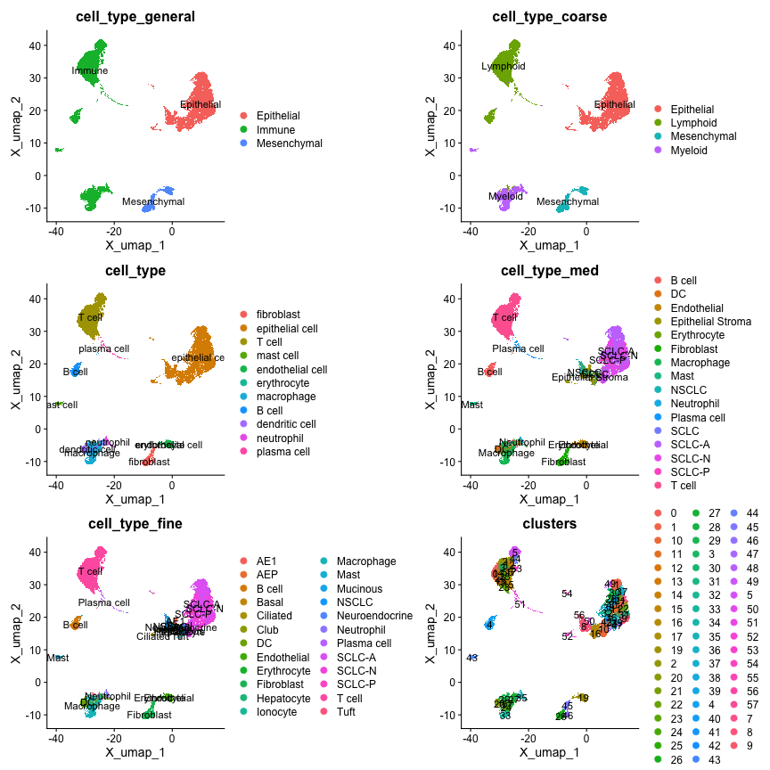

From the plots, we see that the resolution in `cell_type_coarse` matches the resolution in **Figure 1A**.

Next, we look at patient or sample metadata. There are also multiple variables for sample metadata in this object: `donor_id`, `HTAN_Biospecimen_ID`, `HTAN_Participant_ID`, and `batch`. The levels in the `donor_id` variable most closely match the patient IDs specified by Chan et al. 2021 in **Supplementary Table S1**.


```r
SCUBA::unique_values(
  object = full_dataset,
  var = "donor_id"
) |> 
  stringr::str_sort(numeric = TRUE)
```

```{.scroll-100}
##  [1] "PleuralEffusion" "RU255"           "RU426"           "RU653"          
##  [5] "RU661"           "RU666"           "RU675"           "RU676"          
##  [9] "RU681"           "RU682"           "RU684"           "RU685"          
## [13] "RU699"           "RU701"           "RU779"           "RU1038"         
## [17] "RU1057"          "RU1061"          "RU1065"          "RU1066"         
## [21] "RU1080"          "RU1108"          "RU1124"          "RU1128"         
## [25] "RU1134"          "RU1135"          "RU1137"          "RU1138"         
## [29] "RU1144"          "RU1145"          "RU1152"          "RU1170"         
## [33] "RU1181"          "RU1195"          "RU1215"          "RU1229"         
## [37] "RU1231"          "RU1262"          "RU1271"          "RU1293"         
## [41] "RU1311"          "RU1322"
```

`treatment`, `tissue`, and `self_reported_ethnicity` are also of interest, since they allow for comparison of cells in the app based on clinical metadata. `treatment` and `tissue` appear in **Figure 1B** and **Figure 1C** of Chan et al., respectively.

## Modalities and Reductions

The features included in the app for plotting are based on the included modalities. For anndata objects, expression data for features in the primary modality is stored in the `X` slot, and data for additional modalities is stored in `obsm`. Dimensional reduction coordinates for each cell are also stored in `obsm`. Let's use the `obsm_keys()` method to see what alternate modalities and reductions exist.


```r
full_dataset$obsm_keys()
```

```
## [1] "X_pca"  "X_umap"
```

We observe see two matrices in `obsm`: `X_umap` and `X_pca`. These correspond to the UMAP and PCA reductions, respectively.

The UMAP reduction is preferred as it is the current standard for scRNA-seq visualization. The PCA reduction is of limited utility, partially due to the number of dimensions. Plotting in the app is best suited for reductions with exactly two dimensions, so only the UMAP reduction should be included.


```r
# Number of dimensions in each reduction
full_dataset$obsm$X_umap |> dim()
```

```
## [1] 147137      2
```

```r
full_dataset$obsm$X_pca |> dim()
```

```
## [1] 147137     50
```

No alternate modalities are observed in the `obsm` slot for this object. There is only the main modality, gene expression, in the `X` slot.

::: {.callout .callout-info}
#### Note

Other datasets may include surface protein (ADT) data, computed gene signatures per cell, or other data. **For anndata objects, alternate modalities must be stored in `obsm` to be accessible to scExploreR** (with the exception of `X`, of course). Seurat and SingleCellExperiment objects have defined slots for modalities: `@assays` in Seurat objects, and "alternate experiments" for SingleCellExperiment objects. For these object types, scExploreR will use these slots to access modality information. As long as feature expression data for each modality is stored using the convention for Seurat and SingleCellExperiment objects, no additional action is needed for scExploreR to find this data.
:::

## SCLC Epithelial Cells Object

Next, we explore the SCLC Epithelial Cells dataset to see if the characteristics exposed differ from the combined dataset.


```r
library(anndata)

sclc_dataset <- 
  anndata::read_h5ad(
    # Replace the code below with the path to the downloaded dataset
    "~/datasets/small_cell_lung_cancer/Epithelial_SCLC.h5ad"
    )
```

<!-- Figure out the 'imputed_normalized', 'log2(X+0.1)', 'normalized' layers -->

To determine if there are metadata variables that are in the SCLC object that are not in the full object, run `setdiff()` on the variable names from each. If you want to see variables that are in the full object that are not in the SCLC object, switch the order of the parameters to `setdiff()`.


```r
# Identify metadata variables that are specific to the SCLC object
sclc_unique_vars <-
  setdiff(
    SCUBA::meta_varnames(sclc_dataset),
    SCUBA::meta_varnames(full_dataset)
    )

sclc_unique_vars
```

```
##  [1] "n_genes_by_counts"             "log1p_n_genes_by_counts"      
##  [3] "total_counts"                  "log1p_total_counts"           
##  [5] "SCLC_subtype"                  "SCLC_subtype_plus_TP53_RB1_wt"
##  [7] "pval_SCLC-A"                   "pval_SCLC-N"                  
##  [9] "pval_SCLC-P"                   "NEUROD genes"                 
## [11] "MHCI_PRESENTATION"             "MHCII_PRESENTATION"           
## [13] "SCLC_major_subtype_of_sample"  "treatment_categorized"        
## [15] "recurrent_cluster"             "clusters_fine"
```

<!-- Don't forget to mention in the full object section that only categorical            metadata can be added to scExploreR -->

From this we see 16 variables that are not in the full object. Let's view which variables are categorical.


```r
# Iterate through metadata variables and return a vector specifying whether 
# the variable is categorical (character, factor), or numeric (numeric, 
# double, integer)
var_classes <- 
  sapply(
    sclc_unique_vars,
    # Compute the class of the variable
    function(meta_var){
      class(sclc_dataset$obs[[meta_var]])
    }
  )

# Sort to group classes together
sort(var_classes)
```

```
##                  SCLC_subtype SCLC_subtype_plus_TP53_RB1_wt 
##                      "factor"                      "factor" 
##  SCLC_major_subtype_of_sample         treatment_categorized 
##                      "factor"                      "factor" 
##             recurrent_cluster                 clusters_fine 
##                      "factor"                      "factor" 
##             n_genes_by_counts       log1p_n_genes_by_counts 
##                     "numeric"                     "numeric" 
##                  total_counts            log1p_total_counts 
##                     "numeric"                     "numeric" 
##                   pval_SCLC-A                   pval_SCLC-N 
##                     "numeric"                     "numeric" 
##                   pval_SCLC-P                  NEUROD genes 
##                     "numeric"                     "numeric" 
##             MHCI_PRESENTATION            MHCII_PRESENTATION 
##                     "numeric"                     "numeric"
```

We see that SCLC_subtype, SCLC_subtype_plus_TP53_RB1_wt, SCLC_major_subtype_of_sample, treatment_categorized, recurrent_cluster, and clusters_fine are categorical variables. Let's plot them below to better understand them. `clusters` and `treatment` are added for comparison with `clusters_fine` and `treatment_categorized`, respectively.


```r
cell_type_vars <- 
  c("SCLC_subtype",
    "SCLC_subtype_plus_TP53_RB1_wt",
    "SCLC_major_subtype_of_sample",
    "treatment_categorized",
    "treatment",
    "recurrent_cluster",
    "clusters_fine",
    "clusters"
    )

plots <- list()

for (meta_var in cell_type_vars){
  plots[[meta_var]] <- 
    SCUBA::plot_reduction(
      sclc_dataset,
      group_by = meta_var,
      label = TRUE
      ) 
}

patchwork::wrap_plots(plots, ncol = 2)
```

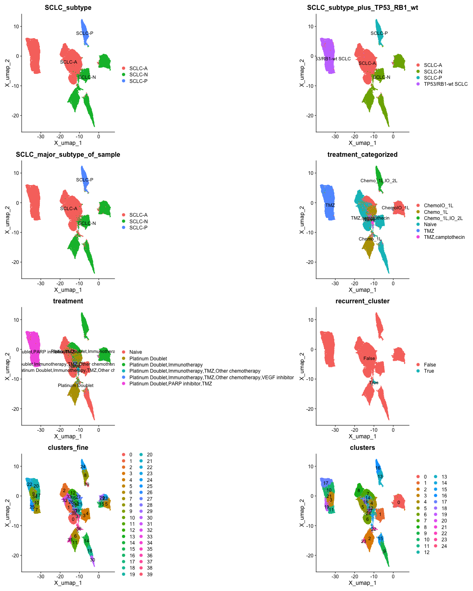

From the plots, we see that `SCLC_major_subtype_of_sample` is identical to `SCLC_subtype`, and `SCLC_subtype_plus_TP53_RB1_wt` has the the same information as the former variables, but includes "TP53/RB1-wt SCLC". **Figure 1G** of Chan et al. Includes this designation, so we will use `SCLC_subtype_plus_TP53_RB1_wt`.

For clustering, the clusters in `clusters` appear to align with the representation of cluster 22 in **Figure 2C**, and `clusters_fine` does not, so we will use `clusters`.

The `recurrent_cluster` variable appears to align with cluster 22 in `clusters`. Below we test if the cell IDs in cluster 22 are identical to the IDs for cells where `recurrent_cluster` is TRUE.


```r
# Use SCUBA::get_all_cells to return cell IDs for cells with a value 
# of TRUE for the "recurrent cluster" column
recurrent_cluster_cell_names <-
  SCUBA::get_all_cells(
    # All cells from the subset below will be returned
    sclc_dataset[sclc_dataset$obs$recurrent_cluster == "True", ]
    )

# Return cell IDs for cluster 22
cluster_22_cell_names <-
  SCUBA::get_all_cells(
    sclc_dataset[sclc_dataset$obs$clusters == "22", ]
    )

# Test if ID vectors are identical
all.equal(
  recurrent_cluster_cell_names,
  cluster_22_cell_names
  )
```

```
## [1] TRUE
```

The cells where `recurrent_cluster` is TRUE are the same cells as those in cluster 22. Since cluster 22 recurs across patients (**Figures 3 A-C** of Chan et al.), and is shown to be associated with a malignant phenotype (**Figure S3B**), including a binary designation for this cluster would create a useful shortcut for end users wishing to examine cells in cluster 22 versus other cells. We will therefore include this variable for the SCLC object.

For `treatment_categorized`, the values in this variable align with the information in **Figure 1B** and **Table S1** of Chan et al. We will use `treatment_categorized` instead of `treatment`.

### Modalities and Reductions

There are no alternate modalities in `obsm`. The reductions in `obsm` are the same as for the main object, with the addition of `X_diffmap`. This reduction does not appear in the figures of Chan et al. and is not explicitly mentioned in the methods section, so it is best to exclude it to keep things simple for the end user.

# Configure Dataset-specific scExploreR Settings in the Config App

Now that we have identified metadata, reductions, and modalities to include for the dataset, the next step is to apply these settings in the config app.

## Anndata-specific Preparation for the Config App

Before loading Anndata objects into the config app, the keys of alternate modalities and reductions must be defined, since both types of data are stored in `obsm`, and there is no exclusive storage slot for reductions or modalities in anndata objects.

Alternate modalities and reductions should be stored in `uns`, under `scExploreR_assays` and `scExploreR_reductions`, respectively. This is done below in python, via reticulate, for both the full object and the SCLC object.

::: {.callout .callout-info}
#### Note

This step is not required for Seurat or SingleCellExperiment objects.
:::


```python
# If you are working in RStudio, make sure to replace the `r` in the 
# code chunk with `python`

# Full object
# Use `r.` to access the full dataset in python using Reticulate
# No non-RNA modalities
r.full_dataset.uns["scExploreR_assays"] = []

r.full_dataset.uns["scExploreR_reductions"] = ["X_umap", "X_pca"]

# SCLC object
r.sclc_dataset.uns["scExploreR_assays"] = []

# Indicate that X_diffmap is a reduction, even though it will not be used
r.sclc_dataset.uns["scExploreR_reductions"] = ["X_umap", "X_pca", "X_diffmap"]
```

After adding the data to `uns`, make sure to save both objects. They can now be loaded into the config app for analysis.


```r
anndata::write_h5ad(
  full_dataset,
  filename = "~/datasets/small_cell_lung_cancer/SCLC_Full.h5ad"
)

anndata::write_h5ad(
  sclc_dataset,
  filename = "~/datasets/small_cell_lung_cancer/Epithelial_SCLC.h5ad"
)
```

## Launching the Config App

To launch the config app, run the code below replacing `object_path` with the path to the downloaded dataset.


```r
scExploreR::run_config(
  object_path = "~/datasets/small_cell_lung_cancer/SCLC_Full.h5ad"
  )
```


Upon loading the config app, you will notice several tabs. The general tab is selected by default. This tab is used to enter basic information on the dataset, which is displayed in the app on the menu that appears when switching between datasets. This is useful when an app is created with multiple datasets, which is the case here.

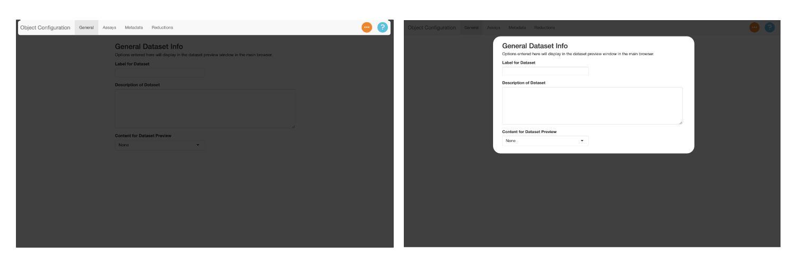

Use the **"Label for Dataset"** field to add a title for the dataset. In this case, we will use "Small Cell Lung Carcinoma Atlas".

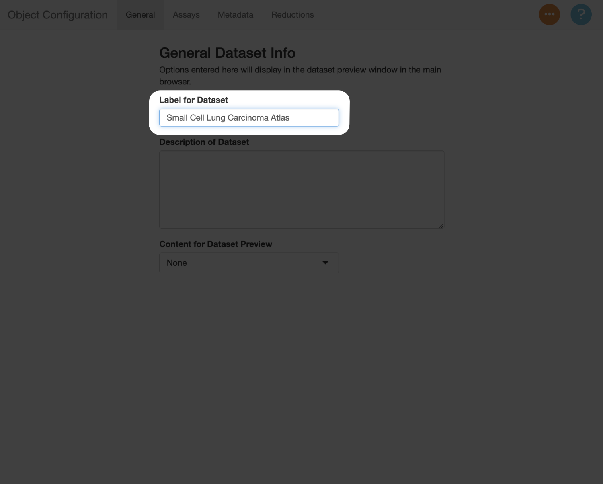

In the **"Description of Dataset"** field, add a summary of the dataset. This should be a high-level description, which can include information like the number of cells, the number of samples, the types of samples included, and other relevant details on the experimental design.

<!--html_preserve--><div class="accordion autoclose info" data-require-bs-caller="accordion()" data-require-bs-version="5" id="bslib-accordion-6363">
<div class="accordion-item" data-value="Suggested description for this example">
<div class="accordion-header">
<button class="accordion-button collapsed" type="button" data-bs-toggle="collapse" data-bs-target="#bslib-accordion-panel-5946" aria-expanded="false" aria-controls="bslib-accordion-panel-5946">
<div class="accordion-icon"></div>
<div class="accordion-title">Suggested description for this example</div>
</button>
</div>
<div id="bslib-accordion-panel-5946" class="accordion-collapse collapse" data-bs-parent="#bslib-accordion-6363">
<div class="accordion-body" style="margin-bottom: 15px;">
<p>147k cells from 19 patients. Twenty-one small cell lung cancer samples are included, along with 24 lung
      adenocarcinoma samples, and four tumor-adjacent normal lung samples included as controls. See Chan et al. 
      Cancer Cell 2021 for more details.</p>
</div>
</div>
</div>
</div><!--/html_preserve-->

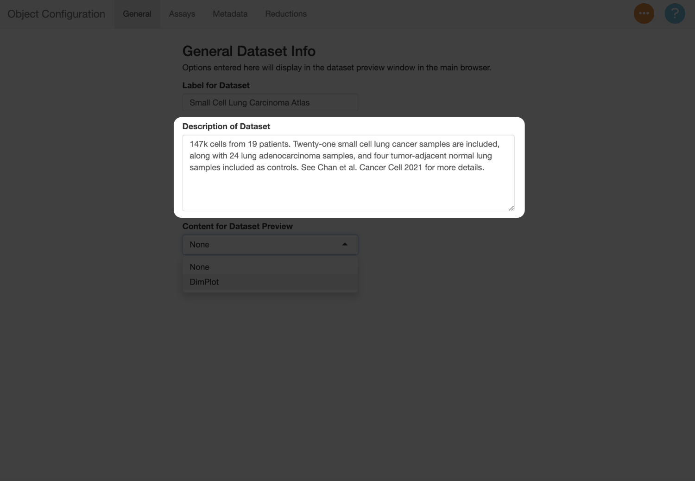

Next, use the **"Content for Dataset Preview"** menu to add a plot thumbnail used to preview the dataset in the selection menu. In this example, the plot will serves as an additional guide when switching between the datasets, since they can be compared against the figures in the paper. You can use the settings below to determine which metadata to show, and which reduction to use (in this example, this should be "X_umap").

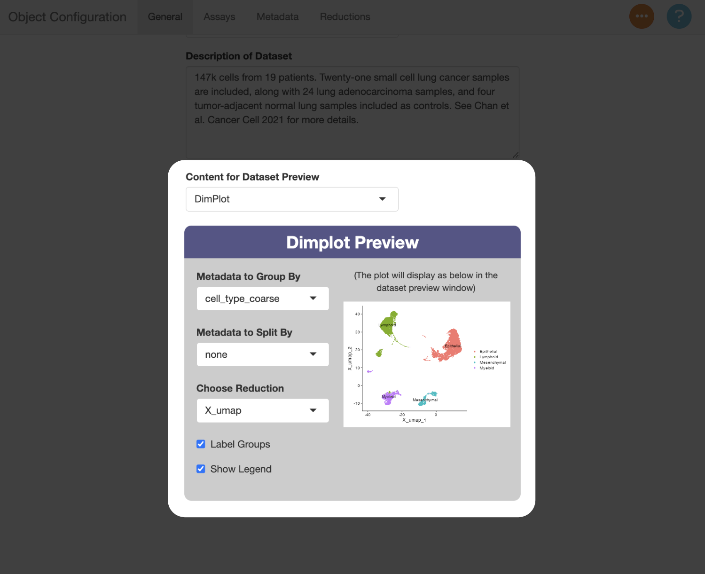

### Assays (Modalities) Tab

Switch to the assays tab to enter information about the modalities in the object. We identified previously that there is only one modality in this object (gene expression, in `X`).

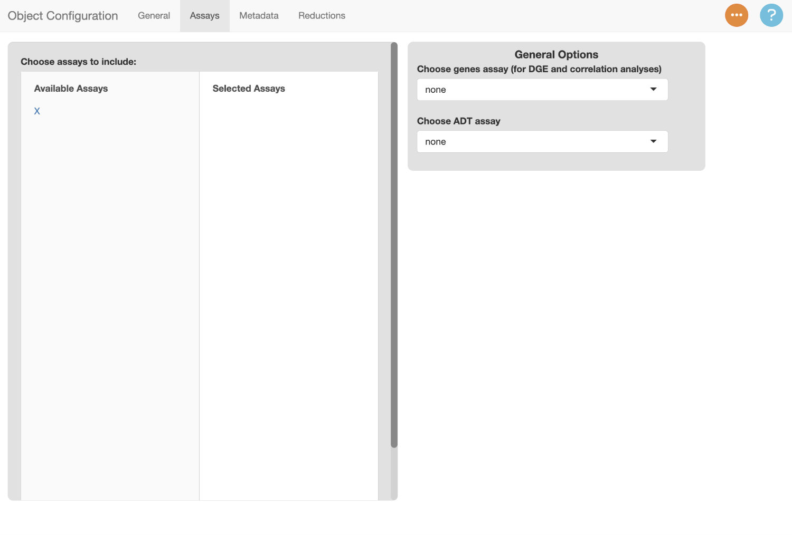

To include a modality in scExploreR, select it under **"Available Assays"**. Once selected, it will appear under **"Selected Assays"**, and a card will appear on the right side of the screen with modality-specific options. Use the text entry to provide a display name for the modality. The display name should be singular instead of plural since the name will display in the context of a single feature from that assay, so in this case, it should be "Gene".

If you want the name to display in plots, click the checkbox. This is helpful when you have features in multiple modalities with the same name, though in this example there is only one modality, so the box can be left unchecked.

::: {.callout .callout-info}
#### Note

When configuring an object with multiple modalities, the checkbox for the "Gene" assay should generally not be checked. Usually most of the features in an object will be genes, so it is not necessary to specify that a feature is a gene. For other modalities, it generally does make sense to add the name of modality to the plot. It is especially helpful to add a label when feature names overlap with names in the gene assay. This can be the case for ADT data, where several surface proteins overlap with human gene symbols (i.e. CD34 and CD36).
:::

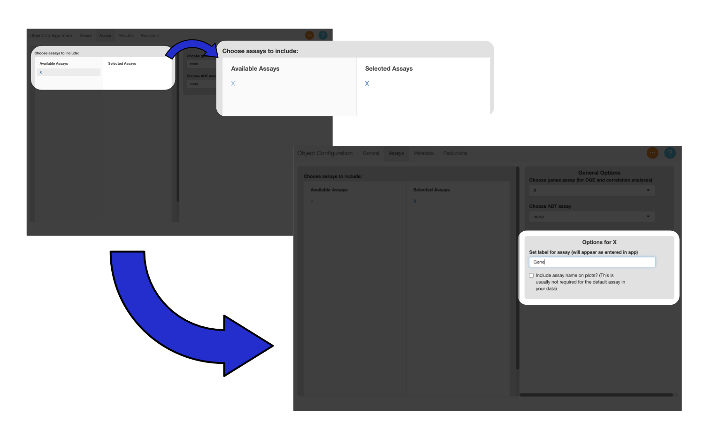

### Metadata Tab

The metadata tab is used to identify the metadata variables to use in the app, and specify settings for each variable.

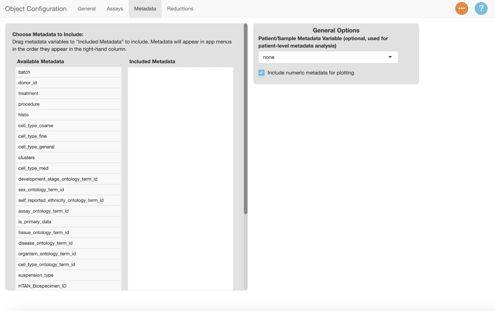

Drag a metadata variable from the **"Available Metadata"** column to the **"Selected Metadata"** column to include it in the app. Use the text box to enter a display name for the variable. Drag **"clusters"** to the **"Selected Metadata"** column and add the label **"Clusters"**.

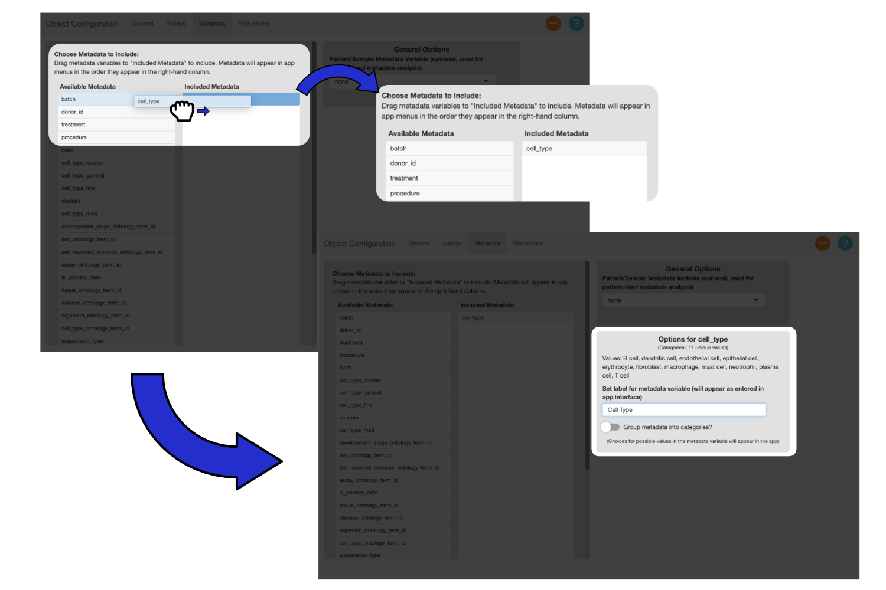


You can drag the variables in the **"Selected Metadata"** column to change their order. Menus in the app will reflect the order of the variables.

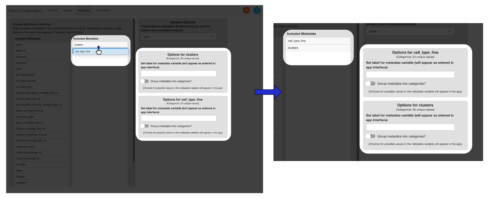

Drag the metadata columns listed below to the **"Selected Metadata"** column, and add the suggested display names.

::: {.card .mb-3}
::: {.card-header style="background-color: #555588;"}
#### Suggested Metadata Options {.card-title .center .white-text}
:::

::: {.card-body style="background-color: #E1E1E1;"}

```{r metadata suggestion table, echo = FALSE, message = FALSE}
meta_vars <- 
  c("clusters", "cell_type_fine", "treatment", "tissue", "donor_id", "HTAN_Biospecimen_ID", "self_reported_ethnicity")

meta_labels <- 
  c( "Clusters", "Cell Type", "Treatment History", "Tissue", "Patient ID",
     "HTAN Sample ID", "Self-Reported Ethnicity")

library(DT)

suggested_labels <- 
  data.frame(
    `Selected Variable` = meta_vars, 
    `Label` = meta_labels
    )

DT::datatable(
  suggested_labels,
  # Define HTML for table header, and eval with escape = FALSE
  escape = FALSE,
  colnames = 
    c("<b>Selected Variable</b>", 
      "<b>Label</b>"
      ),
  # Remove row index
  rownames = FALSE,
    # Disable column filter interface
  filter = "none",
  options = 
    list(
      # Disables search, entries per page interface
      `searching` = FALSE,
      `paging` = FALSE,
      # Disables number of entries footnote
      `info` = FALSE,
      # Disables sorting
      `ordering` = FALSE
      )
  )
```

:::
:::

### Reductions Tab

Next, set settings for reductions in the reductions tab. All reductions are included by default, though the PCA in this example is not useful for plotting, so there is no reason to include it. Select the PCA reduction to remove it.

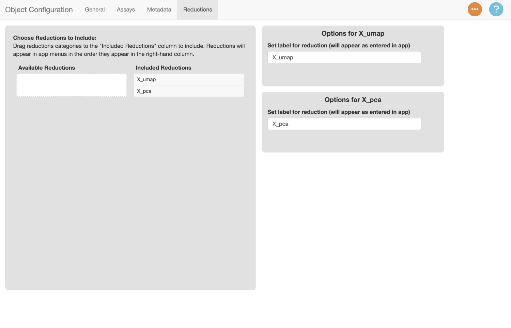

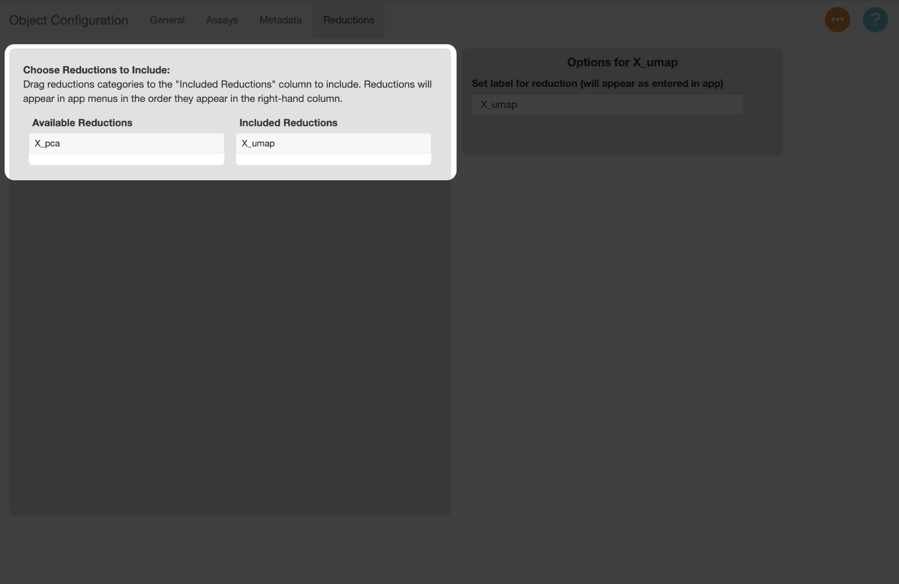

The labels for each reduction default to the keys assigned to them in the object. Let's rename the label for the UMAP reduction to "UMAP".

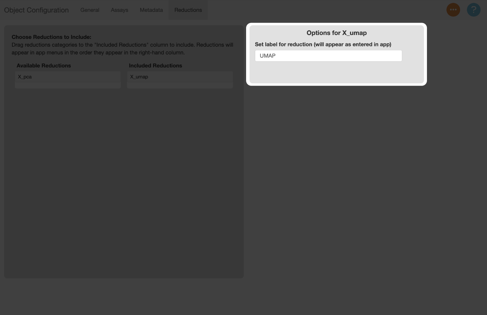

### Save Config file

Now that we've filled out all the information in the config file, let's save the file to disk. To do this, navigate to the orange <!--html_preserve--><i class="fas fa-ellipsis" role="presentation" aria-label="ellipsis icon"></i><!--/html_preserve--> button, select **"Save Config File"**, and use the system prompt that appears to save the file. The file will save with a ".yaml" extension.

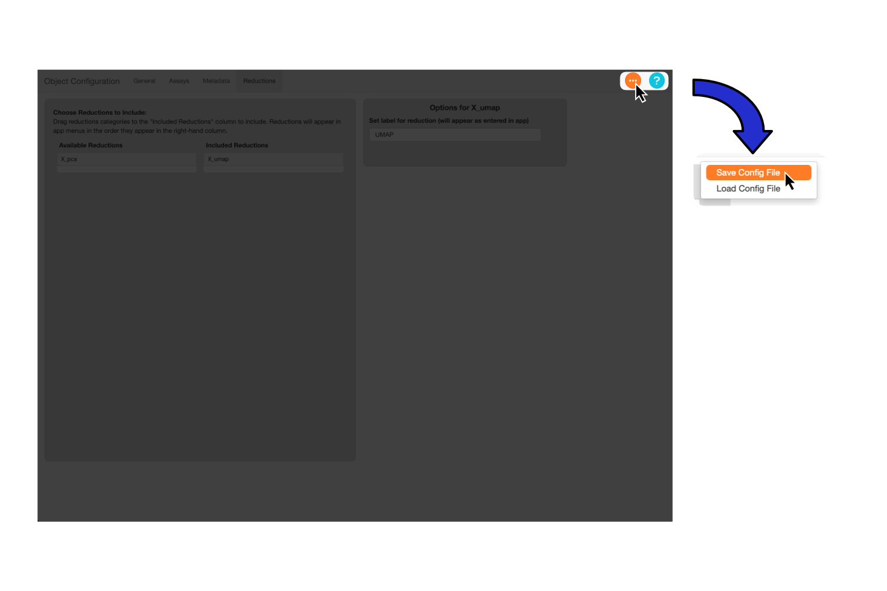

::: {.callout .callout-info}
#### Note

The recommended filename is the the name of your object plus "\_config", though you can use any name you wish.
:::

## Create Config File for Epithelial SCLC Object

Next, we'll create the config file for the SCLC object. Run the config app and repeat the process above, using the suggested settings below as a guide.


```r
scExploreR::run_config(
  object_path = "~/datasets/small_cell_lung_cancer/SCLC_Full.h5ad"
)
```


::: {.card .mb-3}
::: {.card-header style="background-color: #555588;"}
#### Suggested Settings for Epithelial SCLC Object {.card-title .center .white-text}
:::

::: {.card-body style="background-color: #E1E1E1;"}
#### **General Tab**

**Label for dataset:** SCLC Epithelial Cells

**Description:** 54k cells from epithelial tissue, designated as SCLC tumor cells. This is a subset of the combined samples dataset that has been re-clustered. For more information, see Chan et al. Cancer Cell 2021.

**Dataset Preview:**

-   DimPlot
-   Metadata to Group By: SCLC_subtype_plus_TP53_RB1_wt
-   Metadata to Split By: none
-   Choose Reduction: X_umap
-   Label Groups: Checked
-   Show Legend: Checked

#### **Assays Tab**

**Assays selected:** X

**Options for X**

-   **Label:** "Gene"
-   **Checkbox:** unchecked

#### **Metadata Tab**

Table of selected variables, with their corresponding labels. The suggested order is the order of the variables on the table.

```{r sclc_metadata_labels, echo = FALSE, message = FALSE}
meta_vars <- 
  c("SCLC_subtype", "treatment_categorized", "donor_id", "tissue", 
    "clusters", "recurrent_cluster", "self_reported_ethnicity")

meta_labels <- 
  c("SCLC Subtype", "Treatment", "Patient ID", "Tissue", "Clusters", 
    "Recurrent Cluster", "Self-Reported Ethnicity")

suggested_labels <- 
  data.frame(
    `Selected Variable` = meta_vars, 
    `Label` = meta_labels
    )

DT::datatable(
  suggested_labels,
  # Define HTML for table header, and eval with escape = FALSE
  escape = FALSE,
  colnames = 
    c("<b>Selected Variable</b>", 
      "<b>Label</b>"
      ),
  # Remove row index
  rownames = FALSE,
    # Disable column filter interface
  filter = "none",
  options = 
    list(
      # Disables search, entries per page interface
      `searching` = FALSE,
      `paging` = FALSE,
      # Disables number of entries footnote
      `info` = FALSE,
      # Disables sorting
      `ordering` = FALSE
      )
  )
```

#### **Reductions Tab**

Reductions selected: X_umap

Options for X_umap - Label: "UMAP"

:::
:::

## Create an App Config File

The final step before launching scExploreR is to create an app config file. The app config file specifies the paths of all objects used in the app and their respective config files, and it also defines app-wide settings. An example app config file is given below. 

`datasets` is a list of all the datasets in the app. Each key under `datasets` represents a dataset to be loaded in the app instance (in this case, the dataset keys are `combined_sclc` and `epithelial_sclc`). The keys under `datasets` can be any name, as long as spaces are not used (use underscores instead). Any descriptive name for the dataset will work.

Under the dataset keys, there are two keys: `object` and `config`. These should be the path to the object and config file, respectively.

The `RSTUDIO_PANDOC` key is used to define a path to an RStudio pandoc installation. This should only be necessary when running on a linux server. 

To determine if this is necessary, run `rmarkdown::pandoc_available()` in your R console. If `TRUE` is returned, `RSTUDIO_PANDOC` does not need to be specified. In place of a path, enter a YAML `NULL` (`~`) for this key. If you see `FALSE`, you will need to install pandoc manually and provide the path to the installation. `rmarkdown::find_pandoc()` may be able to find the path. 


```yaml
# YAML version
%YAML 1.1
---
datasets:
    combined_sclc:
        # Replace path with path to object
        object: "~/datasets/small_cell_lung_cancer/SCLC_Full.h5ad"
        # Replace with path to config file
        config: "~/datasets/small_cell_lung_cancer/SCLC_Full_config.yaml"
    epithelial_sclc:
        object: "~/datasets/small_cell_lung_cancer/Epithelial_SCLC.h5ad"
        config: "~/datasets/small_cell_lung_cancer/Epithelial_SCLC_config.yaml"
RSTUDIO_PANDOC: ~
```

You can create a config file from R Studio by going to **File** >> **New File** >> **Text File**. After creating the text file, save it in the same directory as the object and config files, and **be sure to add ".yaml" to the filename**. After saving initially, use the structure above and define the paths to the object and config files. 

::: {.callout .callout-info}
#### Note

Don't forget the YAML version at the top. Version 1.1 is the latest version supported by the `yaml` package used to read the data into R.
:::

::: {.callout .callout-info}
#### Note

If you only have one object, you don't need to make an app config file. You can simply run `run_scExploreR`, using the `object_path` and `config_path` parameters instead of `browser_config`.


```r
scExploreR::run_scExploreR(
  object_path = "~/datasets/small_cell_lung_cancer/SCLC_Full.h5ad",
  config_path = "~/datasets/small_cell_lung_cancer/SCLC_Full_config.yaml"
)
```
:::

# Run scExploreR

The app can now be ran by providing the path to the app config file. Use the `browser_config` parameter to specify the path.


```r
scExploreR::run_scExploreR(
  browser_config = "~/datasets/small_cell_lung_cancer/sclc_app_config.yaml"
)
```

