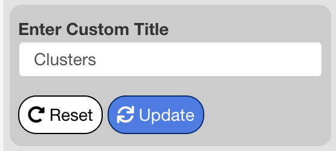
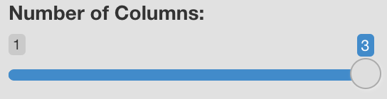
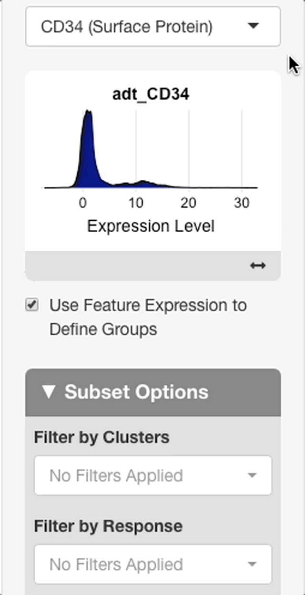

```{r setup, include=FALSE}
knitr::opts_chunk$set(echo = TRUE)
library(shiny)
library(glue)
```

```{=html}
<style type="text/css"> 
  .centered-image{
    display: block; 
    margin-left: auto; 
    margin-right: auto;
    } 
    </style>
```
```{r text_snippets, include = FALSE}
# Functions to write repeating units of documentation
include_legend_description <- 
  "Adds or removes legend displayed on the right side of the plot."

manual_dimensions_description <- 'When enabled, an interface appears allowing 
the user to change the height and width of the plot in pixels using either a slider bar or text entry. When 
entering a value in the text box, press return to update the plot with the 
value. Downloaded plots will have the dimensions defined here if "manually 
adjust plot dimensions" is checked. Otherwise defaults are...?'

include_legend <- 
  function(){
    tagList(
      tags$h3("Include Legend"),
      tags$p(include_legend_description)
    )
  }

manual_dimensions <- 
  function(){
    tagList(
      tags$h3("Manually Adjust Plot Dimensions"),
      tags$p(manual_dimensions_description)
    )
  }

download_button <- 
  function(plot_type){
    text <- 
      glue(
        'Plots are downloaded by clicking the download button at the bottom left 
         side of the "{plot_type} Specific Options" menu. A menu will appear 
         with an option to choose whether to download a .png or .svg file. Downloads in the 
         .svg format can be edited with Adobe Illustrator or a similar program.'
        )
    
    tagList(
      tags$h3("Download Button"),
      tags$p(text)
    )
  }
```

# Plots Tab {#plots-tab}

The plots tab is used to explore and summarize the data using several plot types. All plots may be created from either the full dataset or a subset of cells based on metadata. For more, see the [subsetting section](#Subsets).

## Plot Switches

At the top of the options panel you will see several switches, one for each plot type. To show/hide each plot, click the switch. The available plot types are described briefly below, and each is described in more detail in their respective sections.

-   **DimPlot:** shows each cell on a dimensional reduction plot, e.g. a UMAP, tSNE, or other projection enabled by the browser admin.

-   **Feature Plot:** a DimPlot with cells colored by a feature's value (e.g. gene, surface protein, or other data enabled by the browser admin).

-   **Violin Plot:** displays the distribution of a feature's value across groups of cells as defined in the metadata.

-   **Dot Plot:** shows the average scaled value and percentage of cells with non-zero values for multiple features across groups of cells as defined by metadata categories.

-   **Scatterplot:** compares values of two features. Correlation between values may be quantified in the [Gene Correlations Tab](#correlations-tab).

-   **Ridge Plot:** displays a density plot of a feature's value across a group of cells defined by metadata.

-   **Cell Proportion Plot:** used to visualize the proportion of cells belonging to each value of a categorical metadata variable.

-   **Metadata Pie Chart:** displays the number of samples/patients in each selected categorical metadata value.

## Feature Selection {#feature-selection}

When plot types based on a gene or multiple genes are selected, the feature entry menu will display beneath the switches. Any feature (e.g. genes, surface proteins, gene signatures, or other data enabled by the browser admin) may be entered here. As you type the name of a feature, matching suggestions will appear along with the type of the suggested feature.

## Palettes {#Palettes}

Allows for the selection of color palettes for categorical and continuous data. Selections made will apply to all plots in the plots tab.

## Forming Subsets {#Subsets}

Use the "Subset Options" menu to filter cells in the dataset based on specified criteria, selection of which in these menus will include, not exclude, cells defined by the criteria. These selections will be inherited by all plots.

The dataset can be filtered by categorical metadata, feature expression, or advanced subsetting (see [Advanced (String) Subsetting](#advanced-subsetting)). Select the "add filter" button to access the filter type menu. When choosing categorical filter, any metadata variable can be chosen along with a single value or combination of values. Select  "select all" to include all values in a filter, and select "deselect all" to clear all choices. Once a filter has been chosen, the "confirm filter" button must be selected before moving back to the filter menu. 
When choosing a feature expression filter, the numeric filter menu offers the options to filter cells in the dataset that express the chosen feature at levels above or below a defined threshold, or within a specified range of expression.
Criteria defined by each menu are combined using `AND` syntax, meaning that only cells with metadata selected in one menu, and metadata selected in a second menu will be returned upon subsetting. Menus for the other variables will update based on possible combinations made in the current menu, and invalid combinations will appear in gray. To select a value that is currently invalid, clear or edit selections made in other filter menus, and select a different combination. Press "Apply Subset" to create the subset from the current selection.


### Advanced (String) Subsetting {#advanced-subsetting}

If the "Advanced Subsetting" option is chosen for filtering, a text entry box will appear where subset criteria may be defined via R code. This interface allows for the entry of additional types of criteria, such as:

-   Cells matching a threshold of numeric metadata expression

-   Cells expressing a feature above or below a threshold

-   Cells with feature expression within a defined range

For more information, see the [documentation for string subsetting](advanced_subsetting_documentation.html).

## Dimensional Reduction Plots {#DimPlots}

Dimensional reduction plots are used to summarize relatedness between cells across the dataset, e.g. using gene expression (for more, see [Interpereting scRNA-seq plots](scRNA_Plots_Explained.html)). Cells with similar profiles tend to cluster next to each other, but quantitative connections can't necessarily be made between distance on the plot and similarity in gene expression (i.e. a cell that is 16 units away from another cell is not twice as dissimilar from a cell that is 8 units away).

### Metadata to Group By {#DimPlots-group-by}

This menu is used to select a categorical metadata variable (e.g. cell type) to be used to label cells by color. The key for colors used will display in the legend to the right.

### Metadata to Split By {#DimPlots-split-by}

This menu sets a categorical metadata variable used to "split" cells into separate plots for viewing side-by-side, and defaults to "None".

This menu is useful for comparing projections between different metadata values. For example, broad differences in cell type proportions may be visualized when splitting by disease response. These observations can be analyzed in more detail in the differential gene expression and correlations tabs. 

When a variable is selected, a slider to choose the number of columns will appear under the "Title options menu" (see [Choose number of columns](#choose-number-of-columns) for more info).

### Choose Projection

This menu is used to switch between different methods of dimensional reduction: cells are plotted according to the coordinates selected in the current projection method. Projection methods are generated during dataset processing and added by the browser admin. Common projections include UMAP and t-SNE. For more information on each projection included with the current dataset, contact the user or organization that set up the browser.

### Title Options {#DimPlots-title-options}

The title options menu is used to change or remove the title of the dimensional reduction plot. When set to "Default" the title shown is the name of the selected group by metadata variable. When set to "None", no title is shown. When set to "Custom", an interface will appear beneath the menu to enter a custom title. Press "Update" to apply changes to the title, and "Reset" to revert the title to the default.

{.centered-image style="display: block; margin-left: auto; margin-right: auto;" width="336"}

### Choose Number of Columns {#choose-number-of-columns}

This setting applies to split plots only, and remains hidden until a selection is made in the "Choose Metadata to Split by" menu. Drag the slider to specify the number of columns to use when displaying the panels of a split plot. Possible values may be anywhere from 1 to the number of panels created by the current split by variable.

{.centered-image width="460"}

### Label Groups

Toggles on and off labels displayed above each cluster of cells according to the currently selected group by variable.

### Include Legend {#DimPlots-include-legend}

Adds or removes legend displayed on the right side of the plot.

```{r DimPlot Manual Dimensions and Download Button, echo = FALSE}
manual_dimensions()

download_button(plot_type = "DimPlot")
```

## Feature Plots {#Feature-plots}

Feature plots are dimensional reduction plots that are colored according to feature values instead of categorical metadata. Among other things, feature plots can be used to see which cell types are expressing a feature and to what extent, or to visualize differences in expression between treatment groups when a split by metadata variable is selected.

```{=html}
<!-- ### Metadata to Group By

For feature plots, the group by selection menu controls the metadata to use for labeling cells, if ...?

This menu is used to select a categorical metadata variable to be used to coloring cells. Cells will be colored according to their associated metadata for the variable chosen, and the key for colors used will display in the legend to the right. -->
```
### Metadata to Split By {#Feature-plots-split-by}

This menu sets a categorical metadata variable used to "split" cells into separate plots for viewing side-by-side. One panel will be created for each value in the split by variable. If a single feature is entered in the [feature selection](#feature-selection) menu, the number of columns used for the panels may be adjusted. If two or more features are entered, however, the layout is fixed to place features by row and split by groups by column.

### Choose Projection

This menu is used to switch between visualizing different methods of dimensional reduction: cells are plotted according to the coordinates selected in the current projection method. Projection methods are calculated during dataset processing and added by the browser admin. Common projections include UMAP and t-SNE. For more information on each projection included with the current dataset, contact the user or organization that set up the browser.

### Title Options {#Feature-plots-title-options}

The title options menu is used to change or remove the titles appearing above each panel of the feature plot. When set to "default", the titles shown are equal to the feature if one or multiple features are entered without a split by variable, or to the values in the split by metadata variable when one feature is entered with a split by variable. When set to "none", no titles are shown.

The "Custom" option is available in all settings except for when multiple features are entered and a split by variable is chosen. When set to "custom", an interface will appear to customize titles for every panel displayed on the screen. Enter values and press "Update" to apply changes to the title. The `r icon("redo-alt")` buttons to the right of each title entry will revert that individual title to the default. Pressing "Reset" will revert the titles for all panels to the default.

### Display Options for Legend Title

Used to control the title that displays above the legend. When set to "Feature Name" (the default), the feature name will display above the legend. When set to "Expression", the legend will be set to "Expression". If "No Title" is selected, the title will be removed. This menu is hidden when multiple features are entered and a split by variable is chosen. In this case, no title will display above the legend.

### Choose Number of Columns {#feature-choose-ncol}

This setting is available when one feature is selected with a split by variable, or when multiple features are chosen without a split by variable.

Drag the slider to specify the number of columns to distribute the panels across. Possible values may be anywhere from 1 to the number of panels. This setting is not available when feature co-expression is enabled, or if multiple features are provided with a split by variable.

{.centered-image width="460"}

If multiple features and a split by metadata variable are entered, the output plot will be fixed in a layout of n splits by m features. If you wish to have a custom layout for these plots, it is recommended to create a separate plot for each feature with the desired layout, download each plot, and then combine them using graphic design software. A caveat of this approach is that the value scales may be different for each plot.

### Share Scale Between Features

This setting is available when multiple features are entered with no split by variable. When enabled, all features will be plotted using the same scale. When disabled, each feature is plotted using a scale defined by the minimum and maximum values for that feature. This setting must be enabled to properly compare values between different features using a color scale.

### Display Feature Name Above Panels

This setting is available when one feature is entered and split by metadata is provided. When enabled, the feature name will display centered above the panels created from the split by variable.

### Order Cells by Expression

When checked, cells with the highest values will be plotted on top of the cells with lower expression values- essentially masking them. When unchecked (the default), cells will be plotted in random order giving no preference to either high or low value containing cells to be seen. Enabling this setting can help with features that are expressed in only a few cells in the dataset. Caution should be taken when visualizing features with detectable values in many cells but low average values. In these scenarios the values in the dataset may be exaggerated. To avoid this, we recommend that feature plots be used alongside other means of visualization, such as [violin plots](#violin-plots), [dot plots](#dot-plots), and [ridge plots](#ridge-plots).

### Label Groups

Toggles group by variable labels above each set of cells on and off.

### Include Legend {#feature-plots-include-legend}

Toggles appearance of a legend to the right side of the plot on and off.

```{r Feature Plot Manual Dimensions and Download Button, echo = FALSE}
manual_dimensions()

download_button(plot_type = "Feature Plot")
```

## Violin Plots {#violin-plots}

`# TODO: General description`

### Metadata for Primary Groups {#violin-plots-group-by}

The categorical metadata variable chosen here will determine how cells are grouped. One violin plot will be drawn for each unique value in the chosen metadata variable.

### Metadata for Secondary Grouping {#violin-plots-split-by}

A second categorical variable may be supplied for more in-depth comparison of groups. When specified, violins for each combination between the values of the primary and secondary metadata variable will be drawn. Violins will be colored according to the secondary variable, and split according to the primary variable (see example below). In general, the plot can be used to compare distributions for each value of the primary variable between each value of the secondary variable.

[ADD IMAGE]

### Order of Groups on Plot {#violin-plots-group-order}

Sets the order groups specified by the primary metadata selection appear on the plot. When set to "ascending", values in the primary metadata variable will display in alphanumeric order, from A to Z. When set to "descending", values will display in reverse alphanumeric order. When set to "custom", an interface will appear that will allow you to arrange values in any order. To change the order of a value, drag-and-drop the value in the interface.

### Number of Columns {#violin-choose-ncol}

This setting is available when multiple features have been entered.

Drag the slider to specify the number of columns to distribute the panels across. Possible values may be anywhere from 1 to the number of panels. This setting is not available when feature co-expression is enabled.

{.centered-image width="460"}

### Include Legend {#violin-plots-include-legend}

When checked, the legend will display to the right-hand side of the plot. when unchecked, the legend will be removed.

```{r Violin Plot Manual Dimensions and Download Button, echo = FALSE}
manual_dimensions()

download_button(plot_type = "Violin Plot")
```

## Dot Plots {#dot-plots}

```         
# TODO: General description
```

### Metadata to group by {#dot-plots-group-by}

Specifies the categorical metadata variable used to group cells. One dot per feature will be created for each value of the selected variable.

### Order of Groups on Plot {#dot-plots-group-order}

Sets the order groups appear on the plot. When set to "ascending", values in the group by metadata variable will display in ascending alphanumeric order, from top to bottom. When set to "descending", values will display in descending alphanumeric order. When set to "custom", an interface will appear that will allow you to arrange values in any order. To change the order of a value, drag-and-drop the value in the interface.

### Include Legend {#dot-plots-include-legend}

When checked, the legend will display to the right-hand side of the plot. when unchecked, the legend will be removed.

### Manually Adjust Plot Dimensions

When enabled, an interface appears allowing the user to change the height and width of the plot. The height and width are entered in pixels, and may be chosen using the slider or the text box. When entering a value in the text box, press return to update the plot with the value. Downloaded plots will have the dimensions defined here, if "manually adjust plot dimensions" is checked.

### Use Separate Features for Dot Plot

When checked, an interface will appear to enter additional features, or to remove features that were entered in the [feature selection](#feature-selection) menu. Features added or removed in this interface will apply only to the dot plot.

```{r Dot download button, echo = F}
download_button(plot_type = "Dot Plot")
```

## Scatterplots {#scatterplots}

Scatterplots are useful for viewing co-expression of two features. All cells are plotted according to the expression of each feature, and are useful for qualitative assessments of correlation.

### Feature for x-axis

A feature to plot on the x-axis. All features that can be entered in the [feature selection](#feature-selection) menu may be entered here.

### Feature for y-axis

A feature to plot on the y-axis. All features that can be entered in the [feature selection](#feature-selection) menu may be entered here.

### Metadata to Group By {#scatterplots-group-by}

This menu is used to select a categorical metadata variable to be used to coloring cells. Cells will be colored according to their associated metadata for the variable chosen, and the key for colors used will display in the legend to the right.

<!-- Include Legend -->

```{r, echo = FALSE}
include_legend()
```

### Show Pearson Coefficient

When checked, a pearson correlation coefficient is computed between the two features entered and displayed as the plot title. This is checked by default.

```{r Scatterplot Manual Dimensions and Download Button, echo = FALSE}
manual_dimensions()

download_button(plot_type = "Scatterplot")
```

## Ridge Plots {#ridge-plots}

### Metadata to Group by {#ridge-plots-group-by}

Used to choose a categorical variable for splitting ridge plots into groups. One ridge plot will be drawn for each value in the chosen metadata variable. If set to "None", a single ridge plot for all cells will be plotted

<!-- Include Legend -->

```{r, echo = FALSE}
include_legend()
```

### Define Custom X-axis Limits

When checked, an interface will appear to change the X-axis limits. To specify new limits, enter them in the text boxes for "Lower Bound" and "Upper Bound" and press the "`r icon("sync")` Update" button to apply the new limits. To revert to the default limits, press "`r icon("redo")` Reset".

```{r Ridge Plot Manual Dimensions and Download Button, echo = FALSE}
manual_dimensions()

download_button(plot_type = "Ridge Plot")
```

### Title Options {#ridge-title-options}

The title options menu is used to change or remove the title of the plot. When set to "Default" the title shown is the name of the selected feature. When set to "None", no title is shown. When set to "Custom", an interface will appear beneath the menu to enter a custom title. Press "Update" to apply changes to the title, and "Reset" to revert the title to the default.


## Cell Proportion Plot {#cell-proportion-plot}

### Choose Metadata for Proportions {#cell-proportion-plot-proportion-metadata}

Used to choose the metadata to use for displaying cell type proportions. The proportions illustrated by the stacked bar plots will be relative to the number of cells matching each value in the chosen metadata variable.

### Choose Metadata for Proportion Comparison {#cell-proportion-plot-comparison-metadata}

Used to choose a categorical metadata variable used for comparing cell type proportions. One bar will be plotted for each value of the chosen metadata variable.

### Title Options {#cell-proportion-plot-title-options}

The title options menu is used to change or remove the title of the plot. When set to "Default" the title shown is the name of the selected metadata variable for proportions. When set to "None", no title is shown. When set to "Custom", an interface will appear beneath the menu to enter a custom title. Press "Update" to apply changes to the title, and "Reset" to revert the title to the default.

{.centered-image style="display: block; margin-left: auto; margin-right: auto;" width="336"}

### Order of Groups on Plot {#cell-proportion-plot-group-order}

Sets the order bars created by the proportion comparison metadata variable appear on the plot. When set to "ascending", values in the metadata variable will display in ascending alphanumeric order, from left to right. When set to "descending", values will display in descending alphanumeric order. When set to "custom", an interface will appear that will allow you to arrange values in any order. To change the order of a value, drag-and-drop the value in the interface.

<!-- Manual Dimensions and Download Button -->

```{r, echo = FALSE}
manual_dimensions()

download_button(plot_type = "Cell Proportion Plot")
```

## Metadata Pie Chart {#metadata-pie-chart}

Metadata pie charts show metadata on the sample level rather than the cell level, and is useful for summarizing the current dataset or subset in this regard. Sample-level metadata is compiled based on a metadata variable used as the sample (i.e., the metadata corresponding to "sample ID", "specimen", "patient ID", etc.), and is chosen by the user setting up the browser.

### View Number of Patients by Menu

Sets a categorical metadata variable to use for displaying the sample composition of the dataset. The size of each slice of the pie will be determined by the number of samples matching the corresponding value of a metadata variable provided to "View Number of Patients By". If samples match multiple values of the chosen metadata variable (for example, if cell type is chosen and one sample has multiple cell types), the total value of all slices will be greater than the total number of patients.

### Title Options

The title options menu is used to change or remove the title of the pie chart. When set to "Default" the title shown is the name of the metadata variable in the "View Number of Patients by" menu. When set to "None", no title is shown. When set to "Custom", an interface will appear beneath the menu to enter a custom title. Press "Update" to apply changes to the title, and "Reset" to revert the title to the default.

{.centered-image style="display: block; margin-left: auto; margin-right: auto;" width="336"}

<!-- Include Legend -->

```{r echo = FALSE}
include_legend()
```

<!-- Manual Dimensions -->

```{r echo = FALSE}
manual_dimensions()

download_button(plot_type = "Metadata Pie Chart")
```

# Differential Gene Expression Tab {#dge-tab}

Differential gene expression (DGE) analysis compares groups of cells based on their metadata, and returns a table of genes that differ in expression between the groups. scExploreR uses [presto](https://www.biorxiv.org/content/10.1101/653253v1.full) for DGE analysis, which performs a Wilcoxon Rank Sum and an area under the receiver operator curve (auROC) analysis on the expression data.

Two DGE testing modes are available: differential expression and marker identification. These may be selected using the **"Choose test to perform"** menu. When differential expression is selected, two groups of cells are compared and the genes upregulated/downregulated in one group vs. the other are shown. When marker identification is selected, more than two groups will be compared, and genes that serve as markers of each group (those that are particularly upregulated or downregulated in that group) will be displayed. When running differential gene expression, genes marked as upregulated in a group are differentially expressed to the extent shown in that group **relative to the other group**, whereas for marker identification the genes upregulated in the marker class are deferentially expressed to the extent shown in the marker class **relative to all other cells**.

At this time, differential gene expression can only be performed for genes. Other feature types will be supported in the future.

To run a DGE analysis, follow the process below. This process is described in greater detail in subsequent sections, with more information on the menus involved in each DGE mode.

-   Determine if you would like to perform marker identification or differential expression.

-   If performing marker identification, select the metadata to use for marker classes. If performing differential expression, select two groups based on metadata, or feature expression.

-   For either marker identification or differential expression, determine if you would like to define groups using the full dataset, or a subset of cells.

## Marker Identification Mode {#marker-identification}

### Choose Metadata to Use for Marker Identification {#choose-marker-id-test}

The categorical metadata variable chosen here will be used as the basis for determining groups for marker identification. The choices available in "choose classes to include in marker computation" will update based on the variable selected in this menu.

### Choose classes to include in marker computation

Specific categories from the metadata variable chosen in "choose metadata to use for marker identification" may be included/excluded in the analysis using this menu. The analysis will compute markers for each of the categories selected in this menu. Groups (marker classes) are defined in the context of the full dataset or a subset, depending on selections made in the "[subset options](#dge-subset-options)" menu.

## Differential Expression Mode {#differential-expression}

The two groups defined in differential gene expression may be defined in one of two ways: via categorical metadata, or via feature expression. To define groups via feature expression, check **"use feature expression to define groups"**. The groups are defined within the context of the full dataset or a subset, depending on selections made in the "[subset options](#dge-subset-options)" menu.

### Groups Defined by Categorical Metadata

To define groups based on a categorical metadata variable, select a variable in the **"choose metadata to use for differential gene expression"**, and then choose a category to use for **"group 1"** and **"group 2"**.

### Groups Defined by Feature Expression

{style="float: right; margin-left: 15px;" width="195"}

To define groups based on feature expression, enter a feature from the search bar that appears after "use feature expression to define groups" is checked.

When a feature is entered, an interface will appear with a plot of the expression distribution of that feature in all cells of the dataset (see right). Click the plot to choose an expression threshold. The cells with expression values above the chosen threshold will be compared to the cells below the threshold.

To aid in the selection of a threshold, an interface will display below the plot with statistics on the chosen threshold. The interface will display with the value of the chosen threshold, and the percentage of cells above and below the threshold.

## Subset Options

The subset options menu is used to choose the context in which a differential expression test is performed. If filter criteria are entered in this interface, the test chosen in the menus above will be performed only in cells that meet the chosen criteria.

For example, if a test based on feature expression is chosen, and a specific sample is chosen in the subset options menus, then the differential expression will compare cells above the expression threshold chosen in that sample to cells below the expression threshold in the sample.

The interface for entering criteria is the same as in the plots tab. See ["forming subsets"](#Subsets) for more info.

## Other DGE Settings

### Positive Markers Only

When checked, the table returned will only show genes that are upregulated in each group/marker class. Disabling this option will also show downregulated genes, but this information is redundant since genes downregulated in a group will always show as being upregulated in another group (i.e. in differential expression mode, a gene that is expressed twice as much in group 1 compared to group 2 will be half as expressed in group 2 relative to group 1).

## Interpreting DGE Results

After selecting a test and a subset, press update to run DGE on the chosen groups. Depending on the size of the dataset and the performance of the server, this may take up to two minutes to run, but usually completes in under 30 seconds. When the test is complete, a report will display in the main window.

The "test summary" section will display summary data on the test selected and the subset it was performed on. The "test selected" subsection will display either "differential expression" or "marker identification" based on the test mode chosen. It will also display the groups being compared if differential expression was chosen, or the number of marker classes if marker identification was chosen. The "subset used for test" subsection shows information on the subset of cells chosen. For each categorical metadata variable shown in the app, the categories represented by the cells in the test sample will be shown (if cells from patients A, B, and C are present, this section will list A, B, and C under "patients"). The number of cells in the subset tested is also displayed, and the number of cells in each DGE group or marker class is also shown.

### DGE Table {#differential-expression-columns}

The columns of the DGE table are detailed below. The table may be downloaded via the "`r icon("table")` download table" button.

-   Feature: the gene observed as being differentially expressed.

-   Class (or group): the dge group, or marker class in which the gene is differentially expressed.

-   Average expression: the average expression of the gene in the group or class listed.

-   Log2FC: the log-2 fold change in expression of the gene in the group or class, relative to either the other group (in differential expression mode) or all other cells (in marker identification mode).

-   AUC: the area under the receiver operator curve for the gene, which serves as a measure of how well the gene serves as a marker for the indicated group/class.

-   Adjusted p-value: the adjusted p-value associated with the log2FC calculation in expression of the gene in the current group vs. the other group, or all other cells.

-   Percent expression within class: the percentage of cells in the indicated group or class that express the gene in the group/class.

-   Percent expression outside class: the percentage of cells in the indicated group or class that express the gene outside the group/class.

If either of the percent expression values are very low, or if there is a large difference in percent expression inside the group vs. outside, caution should be taken when interpreting the results. Definitive comparisons are difficult to determine when fewer cells are expressing the feature, and lower expression may be associated with the [dropout effect](https://doi.org/10.1038/nmeth.2967).

-   Additional info: a link to the [GeneCards](https://www.genecards.org/) for each gene is displayed here.

### DGE DimPlot

To visually identify and verify the groups/marker classes being compared in the selected test, a dimensional reduction plot will display beneath the table. After the plot is displayed, a menu ("DimPlot options") will appear in the options panel on the left. The reduction and the color by metadata can be changed here.

# Correlations Tab {#correlations-tab}

This tab is used to compute the correlation between a gene entered and all other genes in the dataset. The correlations analysis uses a pearson correlation coefficient. Only genes may be used for computing correlation at this time: other feature types will be available in the future.

## Running a correlation analysis

To run an analysis, select a gene from the **"Gene Selection"** menu. All pearson coefficients returned will be for the genes relative to the selected gene. To view correlation results in a subset of cells rather than the full dataset, select categories for metadata variables in the **"Subset Options"** panel. The interface for entering subset criteria is the same as in the plots tab, and string subsetting may be performed for advanced subset selection. See ["forming subsets"](#Subsets) for more info. Press the **"submit"** button to run the analysis.

## Interpreting Correlation Results

The **"Subset Summary and Quality Statistics"** section will display the metadata included in the selected subset, along with quality statistics for the analysis. The number of cells in the selected subset will be displayed, along with the number and percentage of cells with non-zero reads for the currently selected gene. If either of these numbers are very low (less than 250 cells or so in the subset and less than 5% of cells with non-zero reads), caution should be taken when drawing conclusions from the results.

### Correlation table

The columns of the correlation table are as below. The table may be downloaded via the "`r icon("table")` download table" button.

-   **Feature:** the gene being compared to the gene entered

-   **Correlation coefficient (global):** the pearson correlation coefficient of correlation with the gene entered, in all cells in the dataset

-   **Correlation coefficient (subset):** if a subset is entered in the options menu to the left, the pearson correlation coefficient of correlation in the chosen subset will display in this column. A column for both the full data and a subset will display.

### Correlation Scatterplots

Click any gene on the correlation table to view a scatterplot of expression for the gene entered vs. the selected gene (for more information on scatterplots, see the [scatterplots](#scatterplots) section). If a subset is selected, two plots will display, one for the full data and the other for the selected subset. The metadata variable used for coloring the plot may be selected using the **"choose metadata to group by"** menu. To download either of the plots, press the "`r icon("poll")` download scatterplot" button corresponding to the desired plot.

# Changing Datasets

To change the dataset, press the `r icon("elipsis-h")` button in the upper right hand corner of the app window, and select **"Choose Dataset"**. A window will appear with the datasets that have been added to the browser, with a description of each. Select a dataset and press "confirm selection" to load the dataset. The dataset can be changed from any tab, and the loaded dataset will affect all three tabs.
