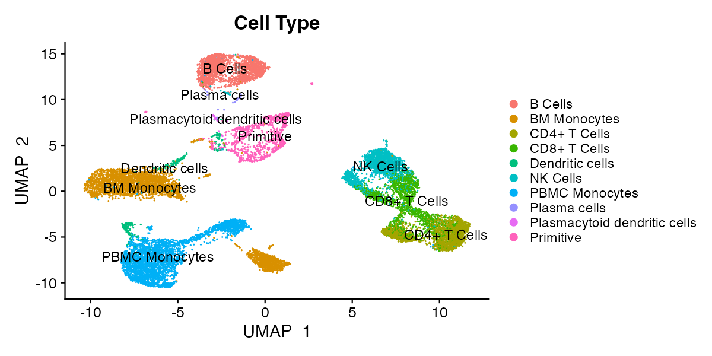

```{css, echo=FALSE}
h1 {
  font-size: 1.17em;
}
```

# Dimensional Reduction Plots (DimPlots) {#dimplot}

Dimensional reduction plots (DimPlots) represent all cells according to the whole of their transcriptional profile (or the profile of other single-cell modalities such as surface protein expression or chromatin accessibility). The whole of expression of one or more modalities is computationally "reduced" to a two dimensional representation, and cells with similar expression profiles appear close together on this representation. The method for doing this varies and is chosen by the bioinformatican that processed the currently loaded single-cell object, though the standard method as of 2025 is principal component analysis (PCA) followed by uniform manifold approximation and projection (UMAP). All reduction methods implemented by the bioinformatican that prepared the object can be toggled in the reductions menu, and you can contact the person who prepared the object for more information (scExploreR authors do not prepare the data shown in the app, only the app itself). 

Over interpretation of DimPlots is a common pitfall and should be cautioned against. The structure of the data is dependent on numerous variables including the specific algorithm used, data sparsity, and type of data used to generate the plots (e.g. RNA-seq, ADT, etc). Therefore, the distance between clusters cannot be used to draw biological conclusions; all that can be concluded is that cells next to one another have similar gene expression profiles. 

For example, in the plot below, it's not necessarily true that the cells labeled as primitive cells are more different from CD4+ T Cells than the cells labeled as NK cells, but it is reasonable to conclude that CD4+ T Cells, CD8+ T Cells, and NK Cells have similar expression profiles. 

{style="display: block; margin: 10px auto;" width="500"}

# Feature Plots {#feature}

Feature plots are DimPlots with cells colored according to the expression of a feature, rather than according to categorical metadata. A feature may be a gene, any other single-cell modality, or numeric metadata. To view available feature types for the current single-cell object, click the "What Can I Enter Here?" dropdown under the "Enter features to display on plots" header. 

Feature plots are useful for identifying clusters that express a gene or surface protein to a greater extent, and when split by a metadata variable, they can give an overview of how feature expression profiles differ between different metadata groups.

Feature plots show a summary of expression, but they can over- or under-represent the expression of features in the dataset. The order cells are plotted may affect the representation of expression on the plot, to a degree that varies based on the expression profile of the feature. The "order cells" option toggles between plotting in random order (the default), or plotting in order of expression, with the cells with highest expression appearing above cells with lower expression. Because of this, feature plots are best used as a summary, and should be followed up with violin, ridge, and dot plots, or differential expression analysis.

## Feature Co-expression plots {#coexpression}

When two features are entered, you may view a co-expression plot that shows the extent to which each feature is expressed. The co-expression plot will show one panel for individual expression of each feature, as well as a "blended" plot that shows the extent to which both features are expressed in each cell. 

# Violin Plots {#vln}

Violin plots show the distribution of expression values for feature in groups of cells defined by a categorical metadata variable. The distribution is represented as a "violin", where the width of the violin is determined by the number of cells in the group with expression values matching each value on the y-axis. Cells are plotted over the violin as points according to their expression values.

# Ridge Plots {#ridge}

Like violin plots, ridge plots represent the distribution of feature expression. Ridge plots are density plots, where the height of the curve is determined by the proportion of cells expressing a feature. Ridge plots may represent expression in all cells, or in groups of cells determined by a metadata variable.

# Dot Plots {#dot}

Dot plots represent the average expression of features in cell groups defined by a metadata variable, and the percentage of cells in each group with non-zero expression of the feature. A dot is plotted for each feature and metadata group combination: groups are plotted on rows, and features are plotted on columns. The size of the dot shows the percentage of cells in a metadata group expressing the feature it represents, and the color of the dot shows the average expression of the representative feature in the group. Dot plots are particularly well-suited for visualizing large numbers of features at once.

# Scatterplots {#scatter}

Scatterplots visualize correlations in expression between two features. To view a plot, enter two features in the "Scatterplot Options" menu. Each point on the scatterplot represents a cell. Cells are plotted with an x-coordinate equal to expression of the first feature, and a y-coordinate equal to expression of the second feature. The plot is similar in principle to a flow cytometry plot.

Scatterplots display a pearson correlation coefficient for expression between the two features as the plot title. The pearson correlation coefficient is based on the full dataset by default. To view correlation in a cell type or a group of cells defined by a metadata variable, subset the object for that group. 

It is likely you will see many cells on both the x- and y-axis. This indicates the dropout effect, a prevalent challenge in single-cell sequencing. Due to the technical complexities of measuring mRNA and other modalities in single-cells, it is common to find zero reads matching a gene in a cell, even when the cell is in a population known to express a gene. The dropout effect complicates statistical conclusions that can be drawn from single-cell data.

# Proportion Plots {#proportion}

Proportion plots are used to compare cell type proportions across groups of cells, typically according to sample level metadata. To view a proportion plot, define the variable to use for proportions (typically cell type), and the variable to use for comparing proportions (typically sample or patient ID). Stacked bars will be drawn, one for each cell group defined by the proportion comparison variable. The height of the stacked bars within each group will be equal to the proportion of cells within the comparison group matching each level of the proportion variable.

Proportion plots are great for summarizing a dataset at the sample level. For example, proportion plots can show the extent to which a specific cell type is represented in different samples in the dataset, and they can indicate samples with cell type proportions that differ from most other samples in the dataset. Proportion plots can show a continuum of samples from lowest to highest proportion of cells matching a specific cell type, and the distribution of the proportion of that cell type in the samples present.

# Metadata Pie Charts {#pie}

Pie charts represent sample-level metadata, showing the number of samples matching each group of a metadata variable. Pie charts only display when the user preparing the dataset indicates a sample-level variable to use for pie charts in the config app.
