```{r setup, include=FALSE}
knitr::opts_chunk$set(echo = TRUE)
```

```{=html}
<style type="text/css"> 
  .centered-image{
    display: block; 
    margin-left: auto; 
    margin-right: auto;
    } 
    </style>
```
# scExploreR Walkthrough

This tutorial will guide you through the use of scExploreR to analyze your data. This is not a comprehensive exploration of each feature: for more information on any feature, see the [full documentation](full_documentation.html). The browser used for this tutorial is hosted here<!--[here]()-->. The dataset contains a single bone marrow and peripheral blood sample from a healthy patient (for more, see the [download page for the dataset](https://figshare.com/articles/dataset/Expression_of_197_surface_markers_and_462_mRNAs_in_15281_cells_from_blood_and_bone_marrow_from_a_young_healthy_donor/13398065), and the related [publication](https://doi.org/10.1038/s41590-021-01059-0)).

Key functionality is grouped into three tabs: plots, differential expression, and gene correlations. The interface on each tab displays the plots and analysis results on the right, and the options on the left hand panel (referred to in this document as the options panel). The plots tab is selected by default, and is helpful for summarizing data and producing visualizations. While this is a good place to get an overview your dataset, some biological questions may be best answered by starting in different tabs. This vignette will walk through common biological questions and how to approach them using the app.

# In which cell types is my gene deferentially expressed?

scExploreR provides differential gene analysis via a wilcoxon rank sum test to determine which cell types express a gene to a greater extent compared to the background (all cells in a dataset). To perform a differential gene expression test, navigate to the "Differential expression" tab.

Marker identification is used to determine which cell types your gene is expressed in. This mode will divide all the cells in the dataset into groups based on cell type, and will compare the expression of **each group** to the **average expression value for all cells**. This method is selected by default in the **"Choose Test to Perform"** menu, so we will leave this the same for now.

For **Choose metadata to use for marker identification**, use the default setting, "Cell Type". In other datasets, this may be "clusters", or something similar, and it is usually the first option.

Under **"Choose classes to include in marker computation"**, leave all cell types selected. If you are interested in seeing data for a subset of only a few cell types, you may select the types to include here, but **note that the change in expression will now be calculated relative to all cells within the cell types entered, instead of all cells in the dataset**. For example, if only "CD8+ T Cells", "B Cells", and "NK Cells" are selected, expression of each gene will be computed for each of these three cell types, relative to all cells in the dataset that are either CD8+ T Cells, B Cells, or NK cells.

Next, uncheck the **"positive markers only"** checkbox at the bottom of the options panel. When this box is checked, only cell types in which a gene is upregulated are included on the table, but when unchecked, cell types where a gene is downregulated are also given. Press **"Update"** to run the analysis.

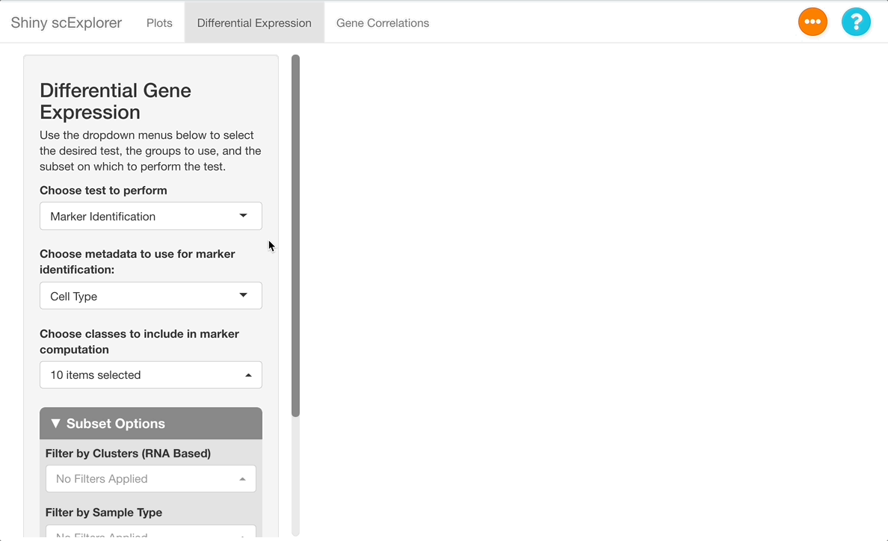{style="display: block; margin: 10px auto;" width="650"}

## Interpreting the Results

After the analysis has finished computing, the results will display in the main panel on the right. A summary of the test ran will display on the top of the screen, with a description of the test performed, and the metadata included in the subset (in this dataset, "Clusters (RNA Based)" represents clusters calculated from the RNA assay, as opposed to "Cell Type", which is computed from both the RNA and surface protein assays). Under the "number of cells per class" heading, be sure to observe how many cells are in each cell type. The number will change if tests are ran on a subset, and if there are too few cells represented, differential expression results will be less reliable for that cell type.

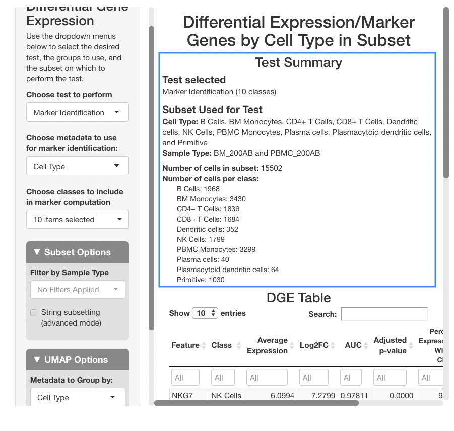{.centered-image width="650"}

Below the stats section, a table of differential gene expression results is displayed. For details on each column of the table, see the [Differential Gene Expression](full_documentation.html#differential-expression-columns) section of the full documentation. Enter a gene in the text box below "Feature" to see results. For this example, we will use "SPINK2".

When determining if a gene is upregulated or downregulated in a cluster, the "Log2FC", "AUC", and "Adjusted p-value" columns are the most useful. The Log2FC will show if the gene is upregulated (positive value) or downregulated (negative value), with the extent of the expression change relative to all cells on a log-2 scale. Look at the adjusted p-value column to see the Benjamini-Hochberg adjusted p-value associated with this expression change, and the AUC value to view the area under the receiving operator curve showing the performance of the gene as a marker for the cell type indicated (how well the gene serves a marker for a given cell type).

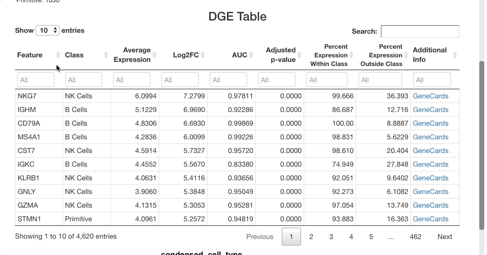{.centered-image width="650"}

For SPINK2, the AUC value is greater than 0.7 in primitive cells, meaning that the gene is a good marker for this cluster. This is supported by the "percent expression within class" and "percent expression outside class" columns, which show that the expression of SPINK2 in the primitive cell types is much higher than in other cells (48% of cells within the primitive cluster express this gene, whereas 2.8% of cells not in this cluster express it). This is also supported by previous research identifying SPINK2 as a stem cell marker; this would be likely to be upregulated in primitive cells, which are early in the differentiation axis of PBMCs. For other cell types, the p-value appears as significant, but the AUC values are much lower than for the primitive cluster. The fold-change in expression is not very high, making SPINK2 an inconclusive marker for other cell types.

# What genes are markers for each cell type?

To identify markers, use the marker identification mode. The same settings will be used as in the last example (cell type as the metadata to use for marker identification, and all cell types selected). The positive markers checkbox should again be left unchecked to see genes downregulated in each cluster as well as those upregulated.

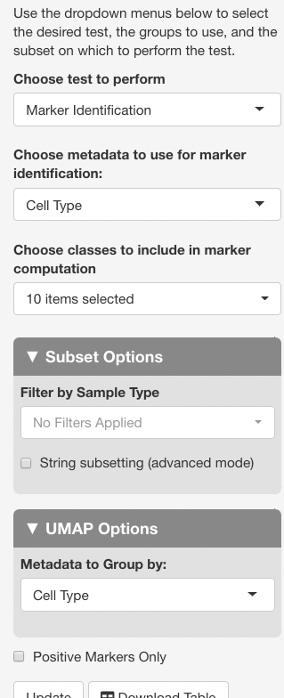{.centered-image width="203"}

After clicking update to run the analysis, markers that differentiate each cell type will be shown. To group markers by cell type, click the "class" column header in the table. Clicking this header will toggle sorting of the cell types by ascending or descending order. To view only a particular cell type, type the name of that cell type in the text box beneath the column header.

The list of markers can be filtered to view the most effective markers for each cell type. To filter based on log-fold change, click the text box beneath the "Log2FC" column. A slider will appear where the upper and lower bounds of the values displayed can be adjusted. To enter more precise bounds, you may type in this text box using the formula `[lower bound] ... [upper bound]`. Either the lower bound or the upper bound can be omitted to view markers that are above or below a threshold, instead of using a range. For example, to view all markers that are expressed at least 3 times higher on a log-2 fold scale, enter `3 ...`. To view cells with a log-2 fold change of less than zero, enter `... 0` (press return after entering the range). You may also use the sliders that appear when clicking on the text box, but a text entry allows for greater precision.

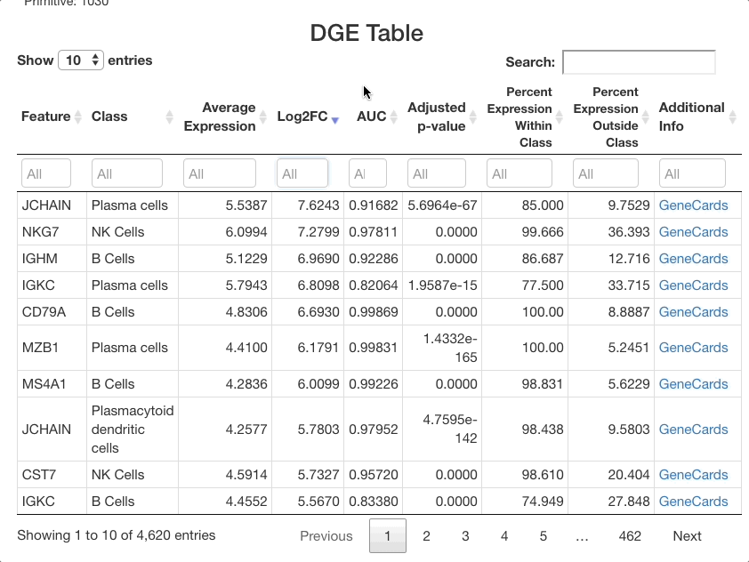{.centered-image width="650"}

The same method can be used with the other columns. For example, entering `0.85 ...` in the AUC column will subset for markers that are particularly good at separating one cell class from another. Sorting by class and subsetting via the text box will allow you to quickly see the most effective markers for each cell type. To view more information for each gene listed, click the GeneCards link in the "additional info" column. When identifying markers, be sure to search for each marker gene listed in the "Feature" text box to ensure that it is not also a strong marker for other cell types. If it is, the gene should be combined with other markers in the table specific to a given cell type to properly distinguish it from other types.

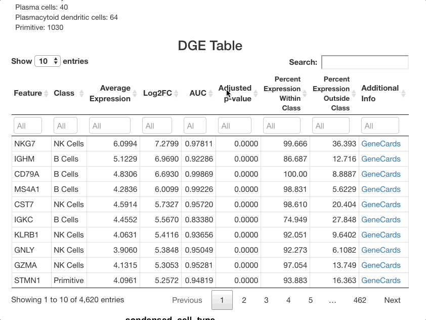{.centered-image width="650"}

## Secondary Analysis: Viewing Markers in Plots tab

Markers can be visualized in the plots tab to support the analysis in the DGE tab. After identifying a good marker for a cell class, copy the marker name and go to the plots tab. In this example we will plot FCN1, which is listed as a good marker for PBMC monocytes. Next enable a feature plot, and type FCN1 into the **"Enter features to display on plots"** text box.

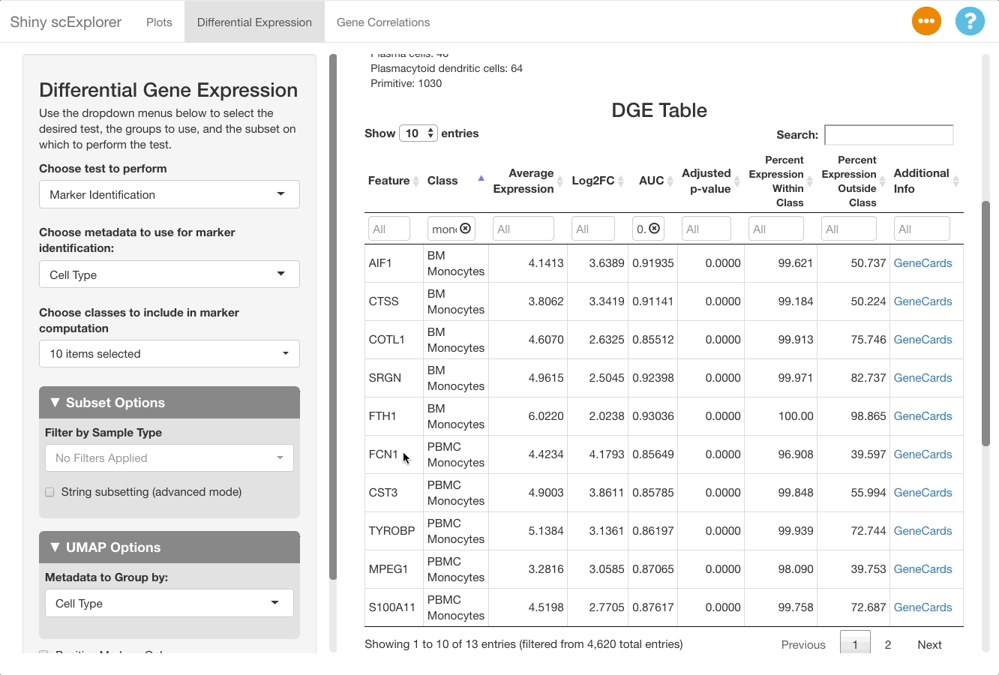{.centered-image width="650"}

The resulting plot shows that FCN1 is highly expressed in the PBMC monocytes, as well as in BM monocytes. This is to be expected since the cell types are both monocytes, and were split due to them clustering separately between the bone marrow and PBMC samples in this reference object (for more information on the dataset, see [here](https://figshare.com/articles/dataset/Expression_of_197_surface_markers_and_462_mRNAs_in_15281_cells_from_blood_and_bone_marrow_from_a_young_healthy_donor/13398065)).

# How does a cell type vary between different samples? {#marker-by-sample}

This reference dataset contains both blood and bone marrow samples from a single patient (see [here](https://figshare.com/articles/dataset/Expression_of_197_surface_markers_and_462_mRNAs_in_15281_cells_from_blood_and_bone_marrow_from_a_young_healthy_donor/13398065) for more information). A UMAP of the dataset shows that dendritic cells are present in both the blood and bone marrow samples, and that they cluster separately. It would be useful to compare clusters between datasets to see if there are genes uniquely expressed in each sample and gain insight as to why this might be the case (determining if it is due to unique biology or a technical artifact).

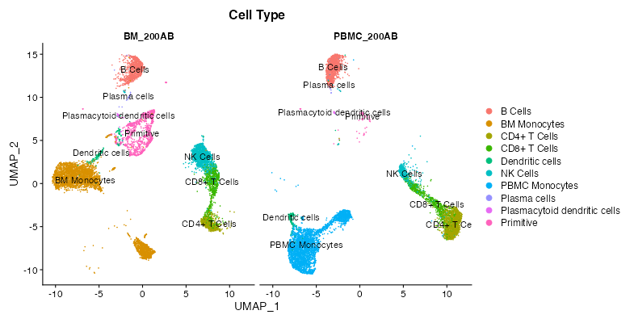{.centered-image width="650"}

To perform this comparison, choose "Marker Identification" under **"Choose Test to Perform"**, and select "Sample Type" under **"Choose metadata to use for marker identification"** instead of "Cell Type". The current selections will compare all cells in the bone marrow sample to the blood sample. To narrow this down to dendritic cells, go to **"Subset Options"** and choose "Dendritic Cells" under **"Subset by Cell Type"**. Leave the **"Positive Markers Only"** checkbox unchecked to view negative markers as well as positive ones.

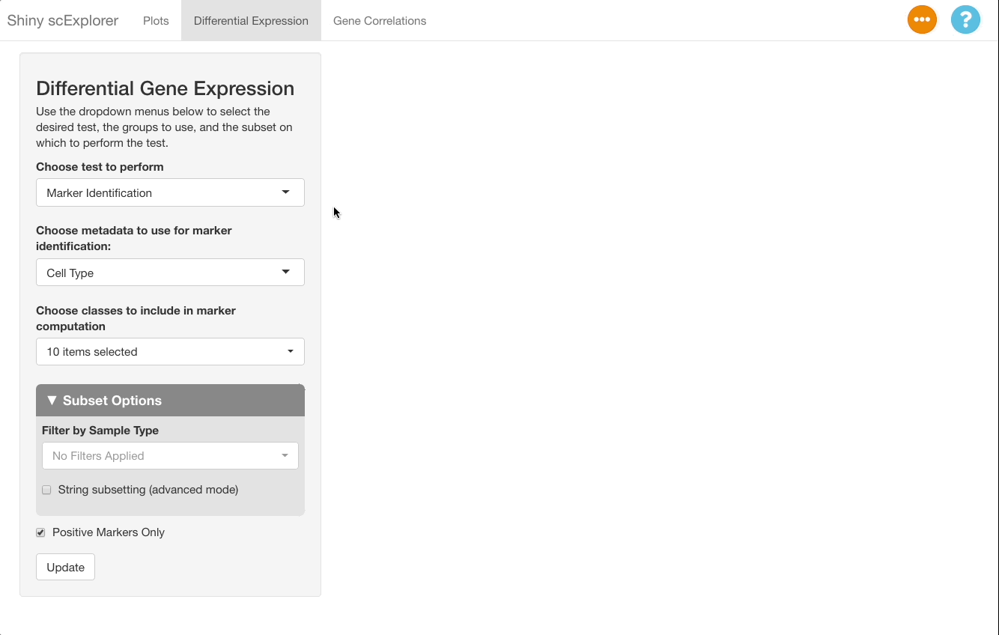{.centered-image width="650"}

When viewing results, note in the **"Test Selected"** and **"Subset Used for Test"** sections that the comparison between the bone marrow (BM_200AB) and the PBMCs (PBMC_200AB) is for dendritic cells only. To view strong positive markers, filter the AUC by entering `0.85 ...` in the text box. To view strong negative markers, filter by AUC using `... 0.15` (you may of course adjust these bounds as desired).

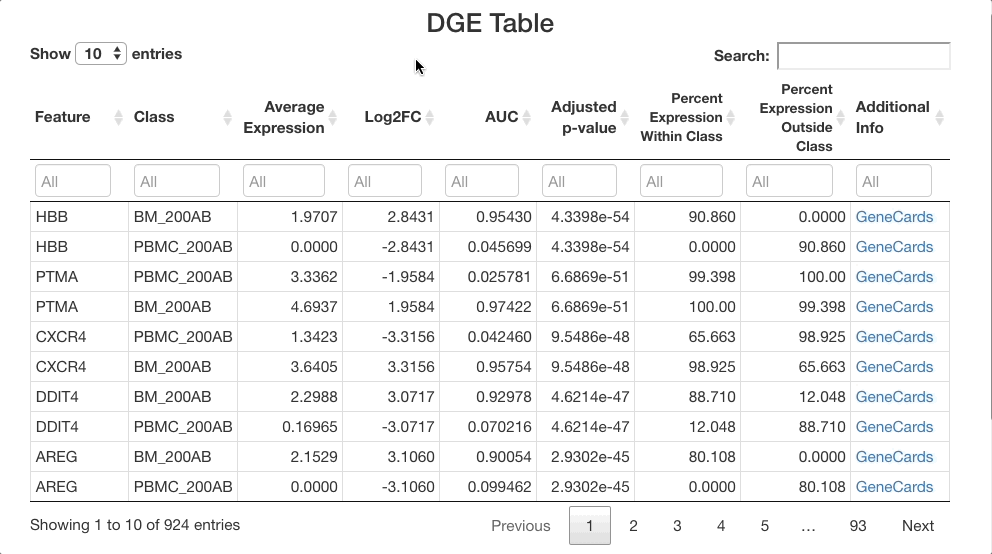{.centered-image width="650"}

# How do I compare cells based on gene/surface protein expression?

The differential gene expression tab also allows you to group cells by expression of a gene, by a surface protein, or by other feature types present in your object. In this example, we will examine CD34, a marker in hematopoiesis that tends to be expressed earlier in the differentiation axis of PBMCs (see below; expression is greatest in the "primitive" cluster). The top genes expressed in CD34+ cells vs. CD34- cells will be examined.

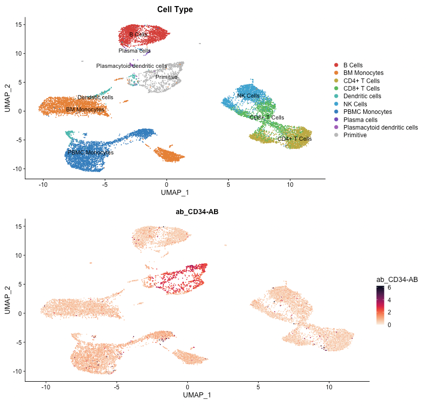{.centered-image width="650"}

To perform this analysis, go to the differential gene expression tab and select "Differential Expression" under the **"Choose test to perform"** menu. Type "CD34", and be sure to choose the entry under the **Surface Protein** header ("CD34-AB (Surface Protein)"). After selecting this option, a density plot of CD34 expression in the dataset will appear.

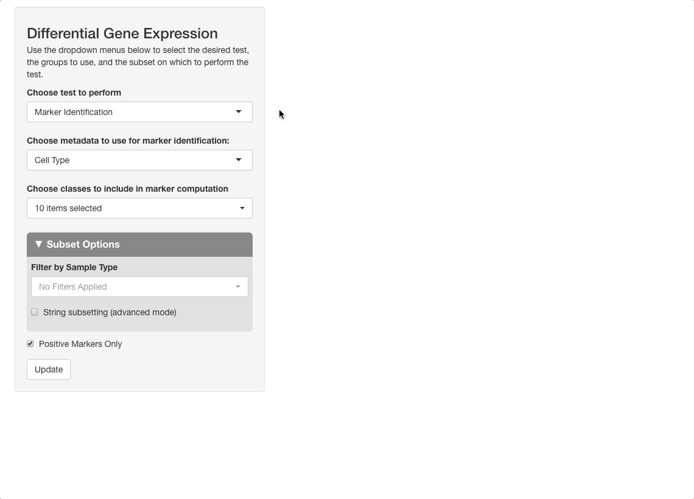{.centered-image width="650"}

On the plot, there are two peaks for CD34 expression. Most cells appear either not to express CD34, or express it to an extent where it is difficult to conclude if the expression reflects biological reality or technical noise. A small portion of cells express CD34 to a greater extent; these groups will be compared. To do this, click on the plot between the two peaks. When mousing over the plot, a vertical line giving the boundary used for comparison will be displayed: all cells above this boundary will be compared to all cells below.

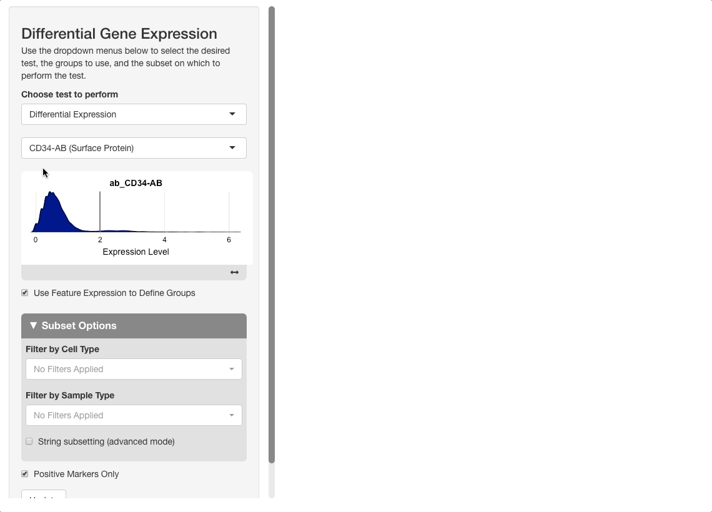{.centered-image width="650"}

After pressing **"Update"** to run the analysis, the results will show genes expressed to a greater extent in CD34+ (high) cells versus CD34- (low) ones. When sorting the table by AUC, several good markers for both groups appear.

# What genes in the dataset are correlated with my gene?

The correlations tab can be used, among other things, to determine which genes are co-expressed with a given gene in a sample. In this example, we will analyze the correlation of other genes with CXCR4, [a top marker for the peripheral blood dendritic cells](#marker-by-sample).

To run this analysis, switch to the correlation tab and enter "CXCR4" in the **"Gene Selection"** menu. Next, subset for dendritic cells by choosing this cell type under the **"Filter By Cell Type"** menus: this will allow for the comparison of correlation results in this cell type to the results in all cells. Press **"Submit"** to run the analysis.

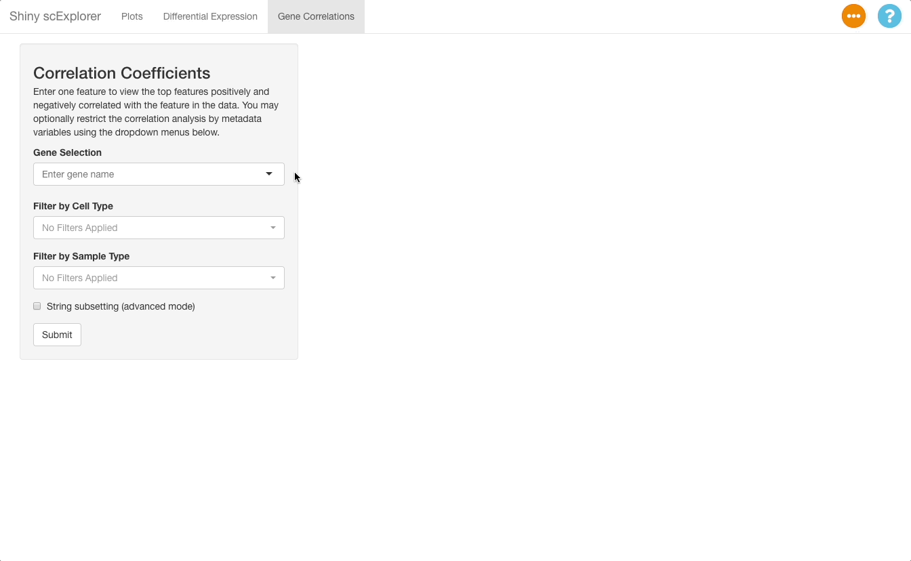{.centered-image width="650"}

The results will show the person correlation coefficients for both the full dataset, and the subset of dendritic cells. The analysis reveals several genes with a fairly strong positive correlation with CXCR4 expression in dendritic cells, but no genes have a strong positive or negative correlation in the context of the full dataset. Click a gene to view scatterplots of the correlation.

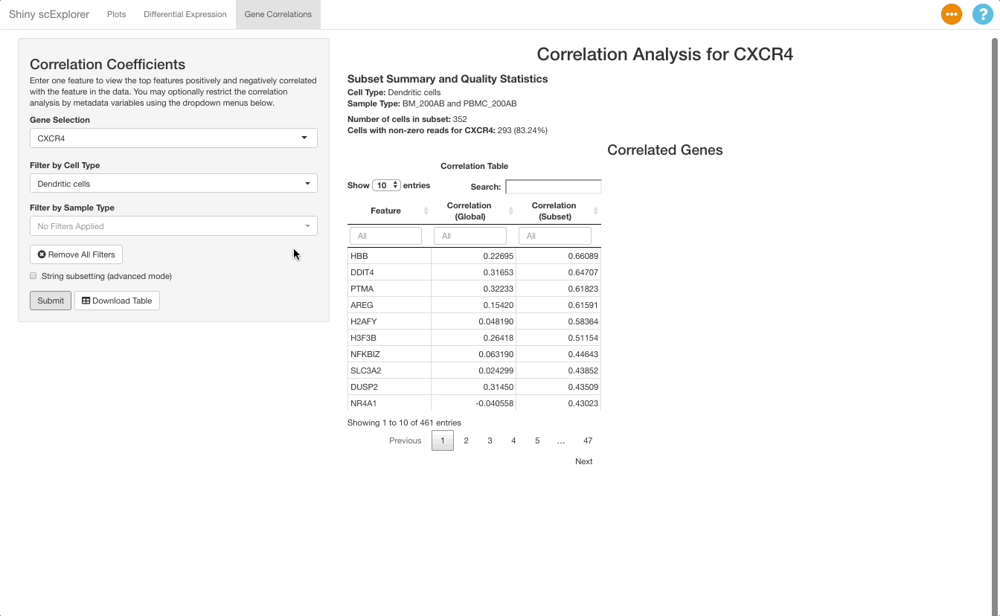{.centered-image width="650"}

To view correlation results for a particular gene of interest, you can search for it using the text box below the "Feature" column header on the table.
