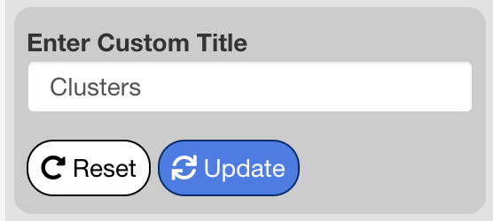
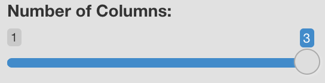

```{r setup, include=FALSE}
knitr::opts_chunk$set(echo = TRUE)
```

```{=html}
<style type="text/css"> 
  .centered-image{
    display: block; 
    margin-left: auto; 
    margin-right: auto;
    } 
    </style>
```
# Plots Tab {#plots-tab}

The plots tab is used to explore and summarize the data using several plot types. All plots may be created from either the full dataset or a subset of cells based on metadata. For more, see the subsetting section.

## Plot Switches

At the top of the options panel you will see several switches, one for each plot type. To show/hide each plot, click the switch. The available plot types are described briefly below, and each is described in more detail in their respective sections.

-   **DimPlot:** shows each cell on dimensional reduction plot, either a UMAP, or a set of other visualizations enabled by the browser admin.

-   **Feature Plot:** a DimPlot with cells colored by expression of a feature (gene, surface protein, or other data enabled by the browser admin).

-   **Violin Plot:** displays the distribution of expression of a feature across groups of cells in the sample.

-   **Dot Plot:** shows the average expression and extent of expression of multiple features across groups of cells in the sample.

-   **Scatterplot:** compares expression of two genes in a sample. All cells are plotted according to the expression value of each of the two features entered. Correlation between genes may be quantified in the [Gene Correlations Tab](#gene-correlations).

-   **Ridge Plot:** displays a density plot of the expression of a feature in all cells, or in groups of cells.

-   **Cell Proportion Plot:** used to visualize metadata. Shows the proportion of cells belonging to each value of a categorical metadata variable, and compares proportions across each value of a second categorical metadata variable.

-   **Metadata Pie Chart:** shows metadata at the sample/patient level. The pie chart displays the number of samples/patients in each categorical metadata value.

## Feature Entry

When plot types based on a gene or multiple genes are selected, the feature entry menu will display beneath the switches. Any gene in the dataset may be entered here. Surface proteins, gene signatures, and other data enabled by the user setting up the browser may also be entered in this menu.

## Palettes

## Subsets

## Dimensional Reduction Plots

Dimensional reduction plots are used to summarize overall gene expression in the sample (for more, see [Interpereting scRNA-seq plots](scRNA_Plots_Explained.html)). Cells with similar expression profiles tend to cluster next to each other, but quantitative connections can't necessarily be made between distance on the plot and similarity in gene expression (i.e. a cell that is 16 units away from another cell is not twice as dissimilar from a cell that is 8 units away).

#### Metadata to Group By

This menu is used to select a categorical metadata variable to be used to coloring cells. Cells will be colored according to their associated metadata for the variable chosen, and the key for colors used will display in the legend to the right.

#### Metadata to Split By

This menu sets a categorical metadata variable used to "split" cells into separate plots for viewing side-by-side. One panel will be created for each value in the split by variable, and cells will display on the panel corresponding to the metadata value for that cell.

This menu is useful for comparing projections between different metadata. For example, transcriptional differences between patients can be quickly spotted when splitting by patient. A patient may be missing a certain cell type, or have a different proportion of cells compared to other patients. Differences spotted in this selection can be analyzed in more detail in the differential gene expression and correlations tabs. This menu defaults to "None".

When a variable is selected, a slider to choose the number of columns will appear under the "Title options menu" (see [Choose number of columns](#choose-number-of-columns) for more info).

#### Choose Projection

This menu is used to switch between different methods of dimensional reduction: cells are plotted according to the coordinates selected in the current projection method. Projection methods are added by the user setting up the browser, and the default projection is chosen by that user. Common projections include UMAP and t-SNE. For more information on each projection included with the current dataset, contact the user or organization that set up the browser.

#### Title Options

The title options menu is used to change or remove the title of the dimensional reduction plot. When set to "Default" the title shown is the name of the selected group by metadata variable. When set to "Custom", an interface will appear beneath the menu to enter a custom title. Press "Update" to apply changes to the title, and "Reset" to revert the title to the default.

{.centered-image style="display: block; margin-left: auto; margin-right: auto;" width="336"}

#### Choose Number of Columns {#choose-number-of-columns}

This setting applies to split plots only, and remains hidden until a selection is made in the "Choose Metadata to Split by" menu. Drag this slider to specify the number of columns to use when displaying the panels of a split plot. Possible values may be anywhere from 1 to the number of panels created by the current split by variable.

{.centered-image width="460"}

#### Label Groups

When this checkbox is enabled, labels will display above each cluster of cells according to the currently selected group by variable.

#### Include Legend 

When checked, the legend will display to the right-hand side of the plot. when unchecked, the legend will be removed.

## Feature Plots

Feature plots are dimensional reduction plots that are colored according to feature expression instead of categorical metadata. Feature plots are useful for determining which cell

## Violin Plots

## Dot Plots

## Scatterplots

## Ridge Plots

## Cell Proportion Plot

## Metadata Pie Chart

# Differential Gene Expression Tab {#dge-tab}

# Correlations Tab {#correlations-tab}
