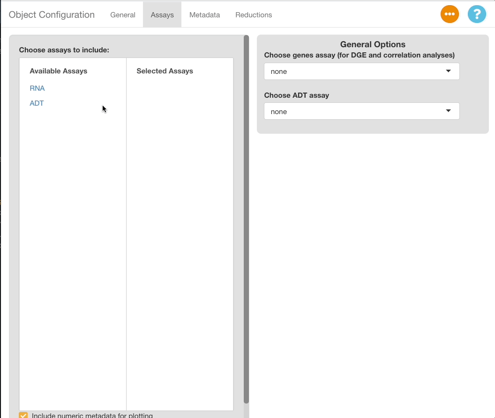

```{r setup, include=FALSE}
knitr::opts_chunk$set(echo = TRUE)
library(shiny)
library(glue)
```

```{=html}
<style type="text/css"> 
  .centered-image{
    display: block; 
    margin-left: auto; 
    margin-right: auto;
    } 
    </style>
```
```{r text_snippets, include = FALSE}
# Functions to write repeating units of documentation
include_legend_description <- 
  "When checked, the legend will display to the right-hand side of the plot. 
  when unchecked, the legend will be removed."

manual_dimensions_description <- 'When enabled, an interface appears allowing 
the user to change the height and width of the plot. The height and width are 
entered in pixels, and may be chosen using the slider or the text box. When 
entering a value in the text box, press return to update the plot with the 
value. Downloaded plots will have the dimensions defined here, if "manually 
adjust plot dimensions" is checked.'

include_legend <- 
  function(){
    tagList(
      tags$h3("Include Legend"),
      tags$p(include_legend_description)
    )
  }

manual_dimensions <- 
  function(){
    tagList(
      tags$h3("Manually Adjust Plot Dimensions"),
      tags$p(manual_dimensions_description)
    )
  }

download_button <- 
  function(plot_type){
    text <- 
      glue(
        'To download plots, press the download button at the bottom left hand 
         side of the "{plot_type} Specific Options" menu. A menu will appear 
         with an option to choose whether to download a .png or .svg file, and 
         a download button will appear beneath that button. Downloads in the 
         .svg format can be edited with Adobe Illustrator or a similar program 
         to add additional labels or modify the text or colors of the plot. 
         All graphical elements added to the plot can be edited individually 
         in an .svg editor.'
        )
    
    tagList(
      tags$h3("Download Button"),
      tags$p(text)
    )
  }
```

The scExploreR config app is used to configure datasets for display in the main browser. This vignette will walk though the operation of the app and detail all settings that may be adjusted.

# Running the config app

The config app can be ran from R Studio or the console by entering the following command:

    run_config(
      object_path = "./object.rds", 
      config_path = NULL 
      )

The `object_path` argument is required, and it must be an .rds containing a single Seurat object. The `config_path` argument is optional and is used to load an existing config file into the app for further editing.

<!-- Put in note container -->

Make sure that the config file loaded is based on the same object as the one specified, and be sure to name your config files using the name of the object to avoid confusion.

# General Info Tab

Upon loading the config app, the "General" tab will be displayed. This tab is used to enter information on the dataset that will be displayed in the main app when the user opens the "Choose Dataset" window.

Use **"Label for Dataset"** to enter a short label for the dataset. Add detailed info for the dataset using the **"Description of Dataset"** field.


Use the **"Content for Dataset Preview"** menu to optionally add a plot as a preview image in the "Choose Dataset" window of the main app. When selecting "DimPlot" as a preview option, a window will appear below with settings for the plot, and a window showing the plot as it will appear in the main app.

#### Plot Settings

Use the **"Metadata to Group By"** to choose the variable for coloring the cells. If the "Label Groups" checkbox is enabled, each color group will also be labeled with the value it represents.The **"Metadata to Split By"** menu may optionally be used to select a variable to "split" the plot, and the number of columns in a split plot can be controlled with the **"Number of columns"** slider. The projection used for the plot is set with **"Choose Reduction"**.


# Assays Tab

Settings for the assays to be included in the Seurat object are entered in this tab.

#### Adding/Removing Assays

To choose which assays to expose in the browser, use the **"Choose assays to include"** menu in the left half of the window. All assays added to the object will appear on the left hand side of the two-column menu, under **"Available Assays"**. Select an assay from this tab to add it to the browser. The assay will now appear under the **"Selected Assays"** column, and a panel of options specific to the assay will appear on the right half of the app window. To remove an assay from the browser, click the assay name in the **"Selected Assays"** tab.



### General Options

On the upper right-hand corner of the screen, a panel of general assay-related options is displayed. The available options are explained below.

#### Choose Genes Assay

The assay selected in this tab will be the assay used when computing differential expression or correlation; it does not effect plotting.

Note, if you wish to include only non-gene assays in the object, you may designate those assays as the "genes" assay, but this may cause issues with the DGE and correlation analyses. The analyses are validated for gene expression only, and may not be accurate when using other data types. We will address means of including these data types in analyses in the future.

#### Choose ADT Assay

If you have a surface protein (ADT) assay in your object, you can specify the assay here to define ADT thresholds. ADT thresholds transform expression data for plots to filter out cells that are unlikely to express the ADT in reality, improving the clarity of feature plots. For more information, see the "ADT Threshold Tab" section.

### Options for Each Assay

Each assay-specific panel will have a text box for entering a label, and a checkbox for including the name of the assay on plots. The label appears in the feature selection menus, and it may be set to a descriptive name to improve the presentation of the main browser (i.e. displaying the genes assay as "Genes", or the ADT assay as "Surface Protein", rather than using the Seurat defaults "RNA" and "ADT"). If the checkbox is selected, the label entered will display on plots. For example, if the label is "Gene", feature plots for the gene "TP53" will have a default title of "TP53 (Gene)" instead of just "TP53".

# Metadata Tab

This tab is used to specify which variables from `object@meta.data` to include, and to set settings for each metadata variable.

#### Adding/Removing/Sorting Metadata

Use the 